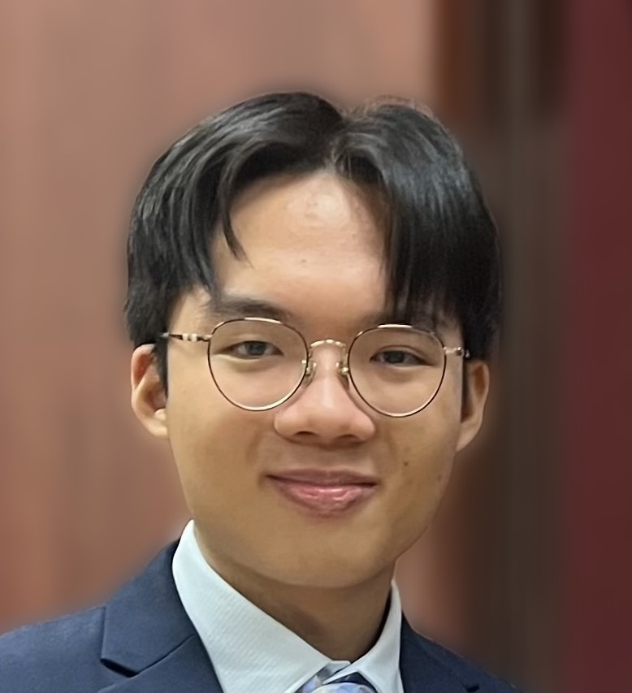

{:title "Past Members"
 :layout :page
 :page-index 1
 :navbar? true
 :to-root "../.."}

    

        
        <h3 class="team-member-name">Erika LAU Tsz Yee</h3>
        <h2 class="team-member-position">Senior Portfolio Manager, Head of Research</h2>
        
Erika Lau leads the global market commentary and thematic investment analysis as the Head of Research at CIM. She has a deep passion for the intricacies of equity markets and overlooks the Consumer Staples portfolio. Erika has honed her skills through valuable internships at HSBC, Citibank and several APAC-focused hedge funds. She is a member of the class of 2025 at the University of Hong Kong, where she is specializing in finance and economics.

        

    

    

        
        <h3 class="team-member-name">Kevin XIA Yunchu</h3>
        <h2 class="team-member-position">Senior Portfolio Manager, Deputy Head of Research</h2>
        
Kevin XIA Yunchu is a senior portfolio manager in CIM, he is currently a year 2 International Business and Global Management student. Kevin is interested in the secondary market, specifically momentum and news driven trading. Besides, Kevin enjoys playing poker and bouldering during his free time.

        

    

    

        
        <h3 class="team-member-name">Darren FUNG Nok Yin</h3>
        <h2 class="team-member-position">Senior Portfolio Manager, Head of Web Development</h2>
        
Darren Fung Nok Yin is a Year 3 Quantitative Finance student at The University of Hong Kong, acting as a senior portfolio manager, head of trading for financial stocks and head of the web development team. With a keen interest in the stock market and investment, he actively pursues technical and fundamental analysis, trading stocks and options as a hobby. His passion drives him to continuously expand his knowledge in these areas.

        

    

    

        
        <h3 class="team-member-name">Haley Nicholas Aidden Gotan Yap</h3>
        <h2 class="team-member-position">Senior Portfolio Manager, Deputy Head of Web Development</h2>
        
Haley Yap is a second-year Economics and Finance student from the Philippines with a deep passion for the financial sector and investments in various opportunities, ranging from stocks, ETFs, cryptocurrencies, and much more.

        

    

    

        
        <h3 class="team-member-name">Cindy TANG Xin</h3>
        <h2 class="team-member-position">Senior Portfolio Manager</h2>
        
Cindy Tang is a Year 2 student double majoring in Economics and Finance and AMPB. She joined CIM because of her interest in investment and asset management. Cindy enjoys analyzing market trends, managing portfolios, and designing macro investment strategies. She’s eager to learn more about using programming to analyze data since digitization is the trend in the financial industry.

        

    

    

        
        <h3 class="team-member-name">Elvis LUI Yu On</h3>
        <h2 class="team-member-position">Senior Portfolio Manager</h2>
        
Elvis is a highly motivated and driven second-year student with a passion for technology and finance. With majors in Systems Analytics and AMPB, he possesses a comprehensive knowledge of the intersection between technology and business value. He has traded cryptocurrencies and US stocks since 2020 and is currently exploring opportunities in the Hong Kong and China shares market.

        

    

    

        
        <h3 class="team-member-name">David FAN Rongshuo</h3>
        <h2 class="team-member-position">Senior Portfolio Manager</h2>
        
David FAN Rongshuo is a senior portfolio manager in CIM, he is currently a year 2 Fintech student. David is interested in both traditional and quantitative trading. He's into macro trading, taking macro events and companies’ announcement into consideration. Besides, David is also interested in momentum trading as well, seeking the optimal moment to “get on the boat” and “get off at the proper time”.

        

    

    

        
        <h3 class="team-member-name">Anson LAM Yat Tung</h3>
        <h2 class="team-member-position">Senior Portfolio Manager</h2>
        
Anson Lam is a Quantitative Finance major student. He is interested in quantitative investing. He is also passionate about closely monitoring market trends, macro news to find inefficiency in the market and profitable trading opportunities.

        

    

    

        
        <h3 class="team-member-name">Jonathan CHEN Junliang</h3>
        <h2 class="team-member-position">Senior Portfolio Manager</h2>
        
Double majoring in Economics and Computer science has equipped me with the ability to conduct in-depth macro fundamental analysis and a solid coding skill set. I am interesed in quantitative research, to combine financial insights with technical capabilities and o analyze market trends from multiple perspectives and develop data-driven strategies for investment and financial analysis.

        

    

    

        
        <h3 class="team-member-name">Dacian DENG Shen</h3>
        <h2 class="team-member-position">Senior Portfolio Manager</h2>
        
DENG Shen Dacian is a third-year BSc(QFin) student with a keen interest in equity investment. Currently serving as a senior portfolio manager at CIM, Shen is eager to enhance his understanding of equity investment through his association with CIM. Shen views CIM as an invaluable platform that offers him the opportunity to expand his knowledge in this field.

        

    

    

        
        <h3 class="team-member-name">Philip TING Tak Lung</h3>
        <h2 class="team-member-position">Senior Portfolio Manager</h2>
        
Philip is a year 4 Accounting and Finance student and a student ambassador at HKU Business School. Apart from his role as a senior portfolio manager at the CIM program, he is also part of the publicity team. He has 3 years of investment experience and is interested in macro investing, portfolio management, and multi-asset allocation.

        

    

    

        
        <h3 class="team-member-name">Alexander PRATAMA</h3>
        <h2 class="team-member-position">Junior Portfolio Manager</h2>
        
Alexander is a first-year Data Science student with a passion for Finance. Although new to finance, he is eager to learn as a portfolio manager. Interested by the intersection of investing and statistics, Alexander is enthusiastic to delve into the world of data-driven finance.

        

    

    

        
        <h3 class="team-member-name">Berkeley WONG Man Yin</h3>
        <h2 class="team-member-position">Junior Portfolio Manager</h2>
        
Berkeley Wong is a highly motivated and detail-oriented Economics and Finance student with a strong inclination towards technical analysis. He possesses a keen interest in both short-term and long-term trading strategies, and aspires to utilize his comprehensive understanding of economic theory and financial principles to conduct meticulous data analysis and forecasting. By employing these analytical skills, Berkeley aims to make well-informed investment decisions that align with his goal of achieving optimal outcomes.

        

    

    

        
        <h3 class="team-member-name">Sam WANG Issam</h3>
        <h2 class="team-member-position">Junior Portfolio Manager</h2>
        
A junior portfolio manager at CIM, Sam is a second-year Quantitative Finance student with an intended second major in Mathematics. He is a passionate math enthusiast, constantly fascinated by the logic behind financial markets. His interest lies in the application of mathematics and statistics in quantitative research of financial firms. Although still relatively new to quantitative, macro, and fundamental analysis, he looks forward to engaging with others and expanding his knowledge in the field.

        

    

    

        
        <h3 class="team-member-name">Joe LIU Cheuk Heng</h3>
        <h2 class="team-member-position">Junior Portfolio Manager</h2>
        
Joe Liu is a rising Finance (Asset Management and Private Banking) undergraduate student at The University of Hong Kong. Driven and passionate about investment, he joined CIM with research interest in industrials and tech stocks.

        

    

    

        
        <h3 class="team-member-name">Jorya ZHOU Qingzhuo</h3>
        <h2 class="team-member-position">Junior Portfolio Manager</h2>
        
Jorya Zhou Qingzhuo, a second-year student majoring in Economics and Finance, possesses a profound fascination for the stock market and investment strategies. Seeking to deepen her understanding of financial markets, she eagerly joined the CIM with the aim of acquiring analytical skills and gaining valuable insights into the dynamic world of finance. Jorya views her involvement in CIM as an enriching opportunity to delve into the complexities of the stock market, comprehend the inner workings of the financial industry, and uncover strategies that can yield consistent returns.

        

    

    

        
        <h3 class="team-member-name">Justin HUANG Yiyang</h3>
        <h2 class="team-member-position">Junior Portfolio Manager</h2>
        
Justin H. is a penultimate undergraduate in Quantitative Finance. He is passionate about closely following market trends, participating in different projects, and gaining exposure to various asset classes and finance practitioners. He has shouldered different responsibilities across front desks and middle offices at well-known Chinese investment banks. Being detail-oriented, flexible, and open, Justin wishes to be an active part of the Centre for Investment Management, where he hopes to accumulate a well-rounded set of technical skills, market sense, and experience in all kinds of industry practices.

        

    

    

        
        <h3 class="team-member-name">Kayla TARLIMAN</h3>
        <h2 class="team-member-position">Junior Portfolio Manager</h2>
        
Kayla Tarliman is a driven business student with a keen interest in investing. As for now, she is working under the publicity team as a Junior Portfolio Manager at CIM. Apart from that, she has experience in analyzing multiple investments as well as managing her own portfolio.

        

    

    

        
        <h3 class="team-member-name">Leo LI Chengpu</h3>
        <h2 class="team-member-position">Junior Portfolio Manager</h2>
        
Li Chengpu is a year 2 student from BSc(QFin), also with a double major in Computer Science. Chengpu currently serves as a senior portfolio manager at CIM, and also a part of the Data Analysis Team. Chengpu focuses on the equity research and investment in US and China Telecommunication Industry. Joining in CIM, he hopes to learn how to design a better investment strategies based on the big data analysis through programming. Chengpu regards CIM as an valuable place for him to improve his investment skills and market senses.

        

    

    

        
        <h3 class="team-member-name">Kevin LIN Ronghan</h3>
        <h2 class="team-member-position">Junior Portfolio Manager</h2>
        
Kevin Lin is the deputy leader in the Data Analysis Division of the CIM. He is a year 3 quantitative finance student with a double major in mathematics and a minor in computer science. His research ambitions are focused on advancing risk management strategies and developing innovative quantitative investment techniques.

        

    

    

        
        <h3 class="team-member-name">Peter LIU Hong Zhi</h3>
        <h2 class="team-member-position">Junior Portfolio Manager</h2>
        
Liu Peter Hong Zhi is a Year 2 BEng(DS&E) student who currently works as a junior portfolio manager at CIM. He is a member of the web development team and enjoys coding, particularly in the areas of data analysis, web development, and machine learning. Despite having limited experience, Liu Peter Hong Zhi is intrigued by the financial market and is eager to expand his knowledge and learn more about the finance industry. He is excited about the opportunity to gain experience in investment through CIM.

        

    

    

        
        <h3 class="team-member-name">Prityush JHAVERI</h3>
        <h2 class="team-member-position">Junior Portfolio Manager</h2>
        
Prityush leads the Data Analysis Team at CIM and is currently enrolled in the Global Engineering and Business Program at HKU, working towards a Dual Degree in Finance and Industrial Engineering. His curiosity and passion for knowledge span a diverse array of subjects; he delves into the effects of macroeconomic trends on global financial markets and explores the rich tapestry of eastern philosophy and its historical roots. With a keen interest in how theoretical concepts apply to real-world scenarios, Prityush is always on the lookout for opportunities to apply his learning in practical settings, particularly in areas that bridge the gap between engineering innovations and business strategy.

        

    

    

        
        <h3 class="team-member-name">Simon ZHOU Xuyang</h3>
        <h2 class="team-member-position">Junior Portfolio Manager</h2>
        
Simon Zhou is the deputy leader of the web development team. He is a freshman majoring in accounting data analytics, possessing a strong passion for the banking sector. In the CIM program, he focuses on researching the equities from the US TMT industry and his strong analytic skills have made him well prepared to step into the world of finance.

        

    

    

        
        <h3 class="team-member-name">Leo XU Mingyuan</h3>
        <h2 class="team-member-position">Junior Portfolio Manager</h2>
        
Leo Xu joined the CIM in December 2023 as a junior portfolio manager. He is a year 2 undergraduate student at the University of Hong Kong Business School, majoring in Business Analytics and Asset Management. As the team head of the Industrials division, he works with his team to cover industrial equities in China and globally, focusing on corporate fundamentals and macro analysis are essential in formulating trading strategies. Leo aims to enter the primary market upon graduation.

        

    

    

        
        <h3 class="team-member-name">Jason YANG Runqi</h3>
        <h2 class="team-member-position">Junior Portfolio Manager</h2>
        
Yang Runqi, a year-3 student in the BEng + BBA double degree program, majors in Computer Science and Finance, with a minor in Computational Mathematics. As a Senior Portfolio Manager at CIM, Yang Runqi demonstrates a strong interest in the intersection of computer science and finance. The opportunity to utilize Clojure for financial market analysis is an exciting endeavor. Yang Runqi eagerly anticipates engaging in discussions with like-minded individuals to exchange knowledge in related field.

        

    

   

