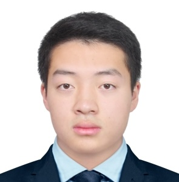

{:title "Past Members"
 :layout :page
 :page-index 1
 :navbar? true
 :to-root "../.."}

## Joined Academic Year 2024-25

    

        
        <h3 class="team-member-name">Catherine ZHAO Wenqi</h3>
        <h2 class="team-member-position">Junior Portfolio Manager, Data Analysis Team Member</h2>
        
Catherine ZHAO Wenqi is a FinTech student with a strong passion for both finance and computer science. As a newcomer to the stock market, she is eager to deepen her understanding of investment strategies and industry insights. Additionally, as a member of Data Analysis Group, she is exploring ways to integrate her programming skills into the world of investing, aiming to bridge the gap between technology and finance.

        

    

    

        
        <h3 class="team-member-name">Yinsheng Yang</h3>
        <h2 class="team-member-position">Junior Portfolio Manager, Data Analysis Team Member</h2>
        
Vincent Yang is a Bachelor of Business Administration (International Business and Global Management) student at the University of Hong Kong. Passionate about finance and investment, Vincent has gained hands-on experience in investment banking, ESG research, and private equity. He has developed skills in financial modelling, equity research, and market analysis, and is eager to apply these skills to contribute to the Centre for Investment Management. Vincent is particularly interested in exploring the intersection of technology and finance, as well as sustainable investment strategies. He looks forward to collaborating with peers and mentors to deepen his understanding of global markets and investment management.

        

    

    

        
        <h3 class="team-member-name">Justin QIAO Yuhan</h3>
        <h2 class="team-member-position">Junior Portfolio Manager, Data Analysis Team Member</h2>
        
Justin is a student majoring in Marketing Analytics and Technology. He holds the position of Junior Portfolio Manager and joined the Data Analysis Group driven by a keen interest in data analysis and asset management. He enjoys analyzing complex data sets, managing portfolios, and developing investment strategies to optimize financial outcomes. Passionate about the intersection of technology and finance, Justin is eager to deepen their knowledge of programming for data analysis. He is excited to contribute to the evolving landscape of analytics and finance.

        

    

    

        
        <h3 class="team-member-name">Chuck Lam Chak Yu</h3>
        <h2 class="team-member-position">Junior Portfolio Manager, Web Development Team Member</h2>
        
Lam Chak Yu, Chuck. Chuck is a Student studying at the University of Hong Kong, double-majoring in Finance and Computer Science. With a strong blend of financial and technical expertise, Chuck has participated in various internships and case competitions. In CIM, he was in the telecommunications team and currently in the technology sector team, focusing on research. He is eager to expand his knowledge and learn more about trading. He is excited about the opportunity to gain experience in investment through CIM.

        

    

    

        
        <h3 class="team-member-name">YEO Kiah Huah</h3>
        <h2 class="team-member-position">Junior Portfolio Manager, Web Development Team Member</h2>
        
Yeo is a student majoring in Data Science and Finance. He is highly passionate about applying technology to the financial sector. As an incoming Technology Summer Analyst at a European investment bank, Yeo aims to contribute his technological expertise and insights to CIM. His primary focus within CIM includes global technology industry research and web development.

        

     

     

           
           <h3 class="team-member-name">Aisha ZHUMABAYEVA</h3>
           <h2 class="team-member-position">Junior Portfolio Manager, Web Development Team Member</h2>
           
Aisha Zhumabayeva is a Financial Technology major student. She is interested in both finance and computer science. Her aim as a junior portfolio manager is to learn more about financial markets, improve her market sense and get more knowledgable on investment strategies. She is eager to contribute to CIM with her skills and knowledge.

           

       

       

          
          <h3 class="team-member-name">Alexander ANTONIOU</h3>
          <h2 class="team-member-position">Junior Portfolio Manager, Research Team Member</h2>
          
Alec Antoniou is a multinational, results-driven student, leveraging his engineering background to identify and capitalize on strategic investment opportunities. With experience in fintech and corporate banking, he currently applies a data-driven, analytical approach to investment strategy in the Utilities team at CIM. His focus lies in energy and infrastructure banking across EMEA and emerging markets.

          

     

     

         
         <h3 class="team-member-name">Robin HONG Yee Ching</h3>
         <h2 class="team-member-position">Junior Portfolio Manager, Research Team Member</h2>
         
Robin Hong Yee Ching is a junior portfolio manager in CIM, he is currently an International Business and Global Management student from the University of Hong Kong. Robin is interested in both traditional trading and investment analysis. He's well-prepared with interpersonal and technical skills, and eager to make a significant impact at CIM.

         

     

     

        
        <h3 class="team-member-name">David LU Zhiyuan</h3>
        <h2 class="team-member-position">Junior Portfolio Manager</h2>
        
David Lu Zhiyuan is a Computer Engineering student with a minor in Finance. Zhiyuan currently serves as a junior portfolio manager at CIM and is also a part of the research group. With strong analytical and problem-solving skills from his engineering background, he is eager to apply quantitative approaches to investment research and financial modelling. Through CIM, he hopes to refine his market analysis skills, gain exposure to different asset classes, and build a solid foundation for a future career in finance.

        

    

## Joined Academic Year 2023-24

    

        
        <h3 class="team-member-name">Alex XU Shu Ming</h3>
        <h2 class="team-member-position">Senior Portfolio Manager, Head of Data Analysis 2024-25</h2>
     <h4 class="team-member-group">Industry Group: Technology</h4>
        
Alex is a driven student of the International Business and Global Management program from the University of Hong Kong, possessing a keen interest in consulting and investment analysis. With a robust understanding of business principles, exceptional interpersonal and technical skills, and a deep passion for financial markets and quantitative strategies, he is well-prepared and eager to make a significant impact in the field of business and finance.

        

    

    

        
        <h3 class="team-member-name">Bella LIU Yiming</h3>
        <h2 class="team-member-position">Senior Portfolio Manager, Deputy Head of Data Analysis 2024-25</h2>
        <h4 class="team-member-group">Industry Group: Consumer Discretionary</h4>
        
LIU Yiming, Bella, a student in BBA (Fina & ISA), is currently a deputy group leader for the Data Analysis group. Interest across American and HK stock markets. She has been looking at investments related to consumer discretionary and also led the Data analysis group to create a stock price prediction technique, and hopes this will help CIM as a whole.

        

    

    

        
        <h3 class="team-member-name">Darren FUNG Nok Yin</h3>
        <h2 class="team-member-position">Senior Portfolio Manager, Head of Web Development 2024-25</h2>
        <h4 class="team-member-group">Industry Group: Financials</h4>
        
Darren Fung Nok Yin is a Quantitative Finance student at The University of Hong Kong, acted as a senior portfolio manager, head of trading for financial stocks and head of the web development team. With a keen interest in the stock market and investment, he actively pursues technical and fundamental analysis, trading stocks and options as a hobby. His passion drives him to continuously expand his knowledge in these areas.

        

    

    

        
        <h3 class="team-member-name">Haley Nicholas Aidden Gotan Yap</h3>
        <h2 class="team-member-position">Senior Portfolio Manager, Deputy Head of Web Development 2024-25</h2>
     <h4 class="team-member-group">Industry Group: Utilities</h4>
        
Haley Yap is a Economics and Finance student from the Philippines with a deep passion for the financial sector and investments in various opportunities, ranging from stocks, ETFs, cryptocurrencies, and much more.

        

    

    

        
        <h3 class="team-member-name">Erika LAU Tsz Yee</h3>
        <h2 class="team-member-position">Senior Portfolio Manager, Head of Research 2024-25</h2>
        <h4 class="team-member-group">Industry Group: Consumer Staples</h4>
        
Erika Lau leads the global market commentary and thematic investment analysis as the Head of Research at CIM. She has a deep passion for the intricacies of equity markets and oversees the Consumer Staples portfolio. Erika has honed her skills through valuable internships at HSBC, Citibank and several APAC-focused hedge funds. She is a member of the class of 2025 at the University of Hong Kong, where she is specializing in finance and economics.

        

    

    

        
        <h3 class="team-member-name">Kevin XIA Yunchu</h3>
        <h2 class="team-member-position">Senior Portfolio Manager, Deputy Head of Research 2024-25</h2>
        <h4 class="team-member-group">Industry Group: Consumer Staples</h4>
        
Kevin XIA Yunchu is a senior portfolio manager in CIM, he is an International Business and Global Management student. Kevin is interested in the secondary market, specifically momentum and news driven trading. Besides, Kevin enjoys playing poker and bouldering during his free time.

        

    

    

         
         <h3 class="team-member-name">Jonathan CHEN Junliang</h3>
         <h2 class="team-member-position">Senior Portfolio Manager, Research Team Member</h2>
         <h4 class="team-member-group">Industry Group: Energy</h4>
         
Double majoring in Economics and Computer Science has equipped me with the ability to conduct in-depth macro fundamental analysis and a solid coding skill set. I am interesed in quantitative research, to combine financial insights with technical capabilities and analyze market trends from multiple perspectives and develop data-driven strategies for investment and financial analysis.

         

     

     

         
         <h3 class="team-member-name">Dacian DENG Shen</h3>
         <h2 class="team-member-position">Senior Portfolio Manager, Research Team Member</h2>
         
DENG Shen Dacian is a BSc(QFin) student with a keen interest in equity investment. Having served as a senior portfolio manager at CIM, Shen is eager to enhance his understanding of equity investment through his association with CIM. Shen views CIM as an invaluable platform that offers him the opportunity to expand his knowledge in this field.

         

     

   

       
       <h3 class="team-member-name">Anson LAM Yat Tung</h3>
       <h2 class="team-member-position">Senior Portfolio Manager</h2>
       <h4 class="team-member-group">Industry Group: Utilities</h4>
       
Anson Lam is a Quantitative Finance major student. He is interested in quantitative investing. He is also passionate about closely monitoring market trends, macro news to find inefficiency in the market and profitable trading opportunities.

       

   

   

       
       <h3 class="team-member-name">Carlos OR King Nang</h3>
       <h2 class="team-member-position">Junior Portfolio Manager</h2>
       <h4 class="team-member-group">Industry Group: Consumer Discretionary</h4>
       
King Nang is a student studying International Business and Global Management at the University of Hong Kong. As an amateur investor majoring in finance, he possesses a deep understanding of the intricacies of financial markets. King Nang's passion for stock trading is matched only by his fascination with business analytics. His analytical mindset and dedication to staying informed about market trends make him a promising individual in the world of finance.

       

   

   

        
        <h3 class="team-member-name">Alexander PRATAMA</h3>
        <h2 class="team-member-position">Junior Portfolio Manager</h2>
    <h4 class="team-member-group">Industry Group: Technology</h4>
        
Alexander is a Data Science student with a passion for Finance. Although new to finance, he is eager to learn as a portfolio manager. Interested by the intersection of investing and statistics, Alexander is enthusiastic to delve into the world of data-driven finance.

        

    

    

        
        <h3 class="team-member-name">Berkeley WONG Man Yin</h3>
        <h2 class="team-member-position">Junior Portfolio Manager</h2>
        <h4 class="team-member-group">Industry Group: Materials</h4>
        
Berkeley Wong is a highly motivated and detail-oriented Economics and Finance student with a strong inclination towards technical analysis. He possesses a keen interest in both short-term and long-term trading strategies, and aspires to utilize his comprehensive understanding of economic theory and financial principles to conduct meticulous data analysis and forecasting. By employing these analytical skills, Berkeley aims to make well-informed investment decisions that align with his goal of achieving optimal outcomes.

        

    

    

        
        <h3 class="team-member-name">Sam WANG Issam</h3>
        <h2 class="team-member-position">Junior Portfolio Manager</h2>
        <h4 class="team-member-group">Industry Group: Consumer Staples</h4>
        
A junior portfolio manager at CIM, Sam is a Quantitative Finance student with an intended second major in Mathematics. He is a passionate math enthusiast, constantly fascinated by the logic behind financial markets. His interest lies in the application of mathematics and statistics in quantitative research of financial firms. Although still relatively new to quantitative, macro, and fundamental analysis, he looks forward to engaging with others and expanding his knowledge in the field.

        

    

    

        
        <h3 class="team-member-name">Joe LIU Cheuk Heng</h3>
        <h2 class="team-member-position">Junior Portfolio Manager</h2>
        <h4 class="team-member-group">Industry Group: Industrials</h4>
        
Joe Liu is a Finance (Asset Management and Private Banking) undergraduate student at The University of Hong Kong. Driven and passionate about investment, he joined CIM with research interest in industrials and tech stocks.

        

    

    

        
        <h3 class="team-member-name">Jorya ZHOU Qingzhuo</h3>
        <h2 class="team-member-position">Junior Portfolio Manager</h2>
        
Jorya Zhou Qingzhuo, a student majoring in Economics and Finance, possesses a profound fascination for the stock market and investment strategies. Seeking to deepen her understanding of financial markets, she eagerly joined the CIM with the aim of acquiring analytical skills and gaining valuable insights into the dynamic world of finance. Jorya views her involvement in CIM as an enriching opportunity to delve into the complexities of the stock market, comprehend the inner workings of the financial industry, and uncover strategies that can yield consistent returns.

        

    

    

        
        <h3 class="team-member-name">Justin HUANG Yiyang</h3>
        <h2 class="team-member-position">Junior Portfolio Manager</h2>
        <h4 class="team-member-group">Industry Group: Telecommunications</h4>
        
Justin H. is an undergraduate in Quantitative Finance. He is passionate about closely following market trends, participating in different projects, and gaining exposure to various asset classes and finance practitioners. He has shouldered different responsibilities across front desks and middle offices at well-known Chinese investment banks. Being detail-oriented, flexible, and open, Justin wishes to be an active part of the Centre for Investment Management, where he hopes to accumulate a well-rounded set of technical skills, market sense, and experience in all kinds of industry practices.

        

    

    

        
        <h3 class="team-member-name">Kayla TARLIMAN</h3>
        <h2 class="team-member-position">Junior Portfolio Manager</h2>
        <h4 class="team-member-group">Industry Group: Consumer Discretionary</h4>
        
Kayla Tarliman is a driven business student with a keen interest in investing. She worked under the publicity team as a Junior Portfolio Manager at CIM. Apart from that, she has experience in analyzing multiple investments as well as managing her own portfolio.

        

    

    

        
        <h3 class="team-member-name">Kevin LIN Ronghan</h3>
        <h2 class="team-member-position">Junior Portfolio Manager</h2>
        <h4 class="team-member-group">Industry Group: Technology</h4>  
        
Kevin Lin is the deputy leader in the Data Analysis Division of the CIM. He is a quantitative finance student with a double major in mathematics and a minor in computer science. His research ambitions are focused on advancing risk management strategies and developing innovative quantitative investment techniques.

        

    

    

        
        <h3 class="team-member-name">Peter LIU Hong Zhi</h3>
        <h2 class="team-member-position">Junior Portfolio Manager</h2>
        <h4 class="team-member-group">Industry Group: Utilities</h4>
        
Liu Peter Hong Zhi is a BEng(DS&E) student who currently works as a junior portfolio manager at CIM. He is a member of the web development team and enjoys coding, particularly in the areas of data analysis, web development, and machine learning. Despite having limited experience, Liu Peter Hong Zhi is intrigued by the financial market and is eager to expand his knowledge and learn more about the finance industry. He is excited about the opportunity to gain experience in investment through CIM.

        

    

    

        
        <h3 class="team-member-name">Prityush JHAVERI</h3>
        <h2 class="team-member-position">Junior Portfolio Manager</h2>
        <h4 class="team-member-group">Industry Group: Financials</h4>
        
Prityush leads the Data Analysis Team at CIM and is currently enrolled in the Global Engineering and Business Program at HKU, working towards a Dual Degree in Finance and Industrial Engineering. His curiosity and passion for knowledge span a diverse array of subjects; he delves into the effects of macroeconomic trends on global financial markets and explores the rich tapestry of eastern philosophy and its historical roots. With a keen interest in how theoretical concepts apply to real-world scenarios, Prityush is always on the lookout for opportunities to apply his learning in practical settings, particularly in areas that bridge the gap between engineering innovations and business strategy.

        

    

    

        
        <h3 class="team-member-name">Simon ZHOU Xuyang</h3>
        <h2 class="team-member-position">Junior Portfolio Manager</h2>
     <h4 class="team-member-group">Industry Group: Technology</h4>
        
Simon Zhou is the deputy leader of the web development team. He is a freshman majoring in accounting data analytics, possessing a strong passion for the banking sector. In the CIM program, he focuses on researching the equities from the US TMT industry, and his strong analytic skills have made him well prepared to step into the world of finance.

        

    

    

        
        <h3 class="team-member-name">Leo XU Mingyuan</h3>
        <h2 class="team-member-position">Junior Portfolio Manager</h2>
        <h4 class="team-member-group">Industry Group: Industrials</h4>
        
Leo Xu joined the CIM in December 2023 as a junior portfolio manager. He is an undergraduate student at the University of Hong Kong Business School, majoring in Business Analytics and Asset Management. As the team head of the Industrials division, he works with his team to cover industrial equities in China and globally, focusing on corporate fundamentals and macro analysis are essential in formulating trading strategies. Leo aims to enter the primary market upon graduation.

        

    

## Joined Academic Year 2022-23

      

         
         <h3 class="team-member-name">David FAN Rongshuo</h3>
         <h2 class="team-member-position">Senior Portfolio Manager</h2>
         
David FAN Rongshuo was a senior portfolio manager in CIM, he is a student. David is interested in both traditional and quantitative trading. He's into macro trading, taking macro events and companies’ announcements into consideration. Besides, David is also interested in momentum trading as well, seeking the optimal moment to “get on the boat” and “get off at the proper time”.

         

    

    

        
        <h3 class="team-member-name">Cindy TANG Xin</h3>
        <h2 class="team-member-position">Senior Portfolio Manager</h2>
        <h4 class="team-member-group">Industry Group: Telecommunications</h4>
        
Cindy Tang is a student double-majoring in Economics and Finance and AMPB. She joined CIM because of her interest in investment and asset management. Cindy enjoys analyzing market trends, managing portfolios, and designing macro investment strategies. She’s eager to learn more about using programming to analyze data since digitization is the trend in the financial industry.

        

    

    

        
        <h3 class="team-member-name">Elvis LUI Yu On</h3>
        <h2 class="team-member-position">Senior Portfolio Manager</h2>
        <h4 class="team-member-group">Industry Group: Industrials</h4>
        
Elvis is a highly motivated and driven second-year student with a passion for technology and finance. With majors in Systems Analytics and AMPB, he possesses a comprehensive knowledge of the intersection between technology and business value. He has traded cryptocurrencies and US stocks since 2020 and is currently exploring opportunities in the Hong Kong and China shares market.

        

    

    

        
        <h3 class="team-member-name">Philip TING Tak Lung</h3>
        <h2 class="team-member-position">Senior Portfolio Manager</h2>
        <h4 class="team-member-group">Industry Group: Materials</h4>
        
Philip is an Accounting and Finance student and a student ambassador at HKU Business School. Apart from his role as a senior portfolio manager at the CIM program, he is also part of the publicity team. He has years of investment experience and is interested in macro investing, portfolio management, and multi-asset allocation.

        

    

    

        
        <h3 class="team-member-name">Leo LI Chengpu</h3>
        <h2 class="team-member-position">Senior Portfolio Manager</h2>
        <h4 class="team-member-group">Industry Group: Telecommunications</h4>
        
Li Chengpu is a student from BSc(QFin), also with a double major in Computer Science. Chengpu currently serves as a senior portfolio manager at CIM and is also a part of the Data Analysis Team. Chengpu focuses on equity research and investment in the US and China Telecommunication Industry. Joining in CIM, he hopes to learn how to design better investment strategies based on big data analysis through programming. Chengpu regards CIM as a valuable place for him to improve his investment skills and market sense.

        

    

    

        
        <h3 class="team-member-name">Jason YANG Runqi</h3>
        <h2 class="team-member-position">Senior Portfolio Manager</h2>
        <h4 class="team-member-group">Industry Group: Materials</h4>
        
Yang Runqi, a student in the BEng + BBA double degree program, majors in Computer Science and Finance, with a minor in Computational Mathematics. As a Senior Portfolio Manager at CIM, Yang Runqi demonstrates a strong interest in the intersection of computer science and finance. The opportunity to utilize Clojure for financial market analysis is an exciting endeavor. Yang Runqi eagerly anticipates engaging in discussions with like-minded individuals to exchange knowledge in the related field.

        

    

