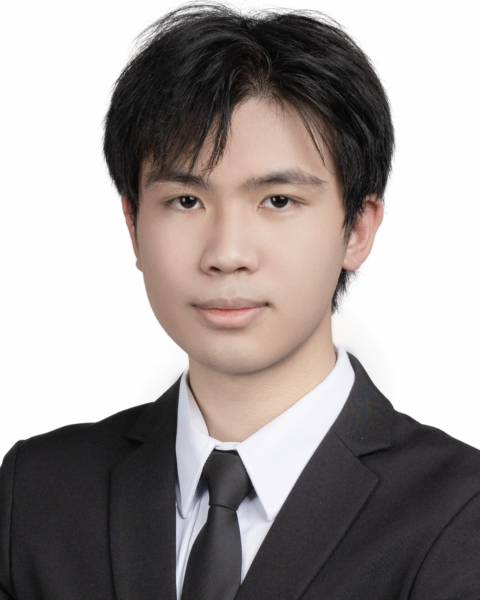
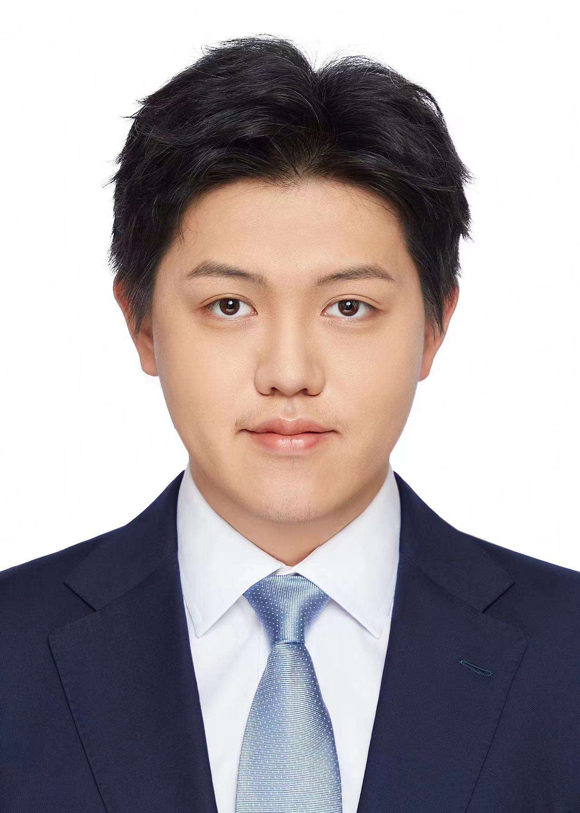

{:title "Our Team"
 :layout :page
 :page-index 1
 :navbar? true
 :to-root "../.."}

## Founder

    

        
        <h3 class="team-member-name">Dr. Matthias BUEHLMAIER</h3>
        <h2 class="team-member-position">Founder</h2>
        
Matthias Buehlmaier is a Principal Lecturer in Finance and the BBA(IBGM) Program Director at the HKU Business School (HKUBS), University of Hong Kong. He is also the Founding Director of the Centre for Investment Management at HKUBS. Buehlmaier has been a Visiting Fellow at the University of Cambridge and a Visiting Scholar at Regensburg University. His research has been published in notable journals and he has won several teaching and research awards. His interests include investment management, investment banking, mergers & acquisitions (M&A), machine learning, AI, and fintech. Buehlmaier developed and taught the world's first university course on text analytics and natural language processing in finance and fintech.

        

    

## Data Analysis Team

    

        
        <h3 class="team-member-name">Alex XU Shu Ming</h3>
        <h2 class="team-member-position">Senior Portfolio Manager, Head of Data Analysis</h2>
        
Alex is a driven sophomore of the International Business and Global Management program from the University of Hong Kong, possessing a keen interest in consulting and investment analysis. With a robust understanding of business principles, exceptional interpersonal and technical skills, and a deep passion for financial markets and quantitative strategies, he is well-prepared and eager to make a significant impact in the field of business and finance.

        

    

    

        
        <h3 class="team-member-name">Bella LIU Yiming</h3>
        <h2 class="team-member-position">Senior Portfolio Manager, Deputy Head of Data Analysis</h2>
        
LIU Yiming, Bella, a Year 2 student in BBA (Fina & ISA), is currently a deputy group leader for the Data Analysis group. Interest across American and HK stock markets. She has been looking at investments related to consumer discretionary for about 2 years and also led the Data analysis group to create a stock price prediction technique, and hopes this will help CIM as a whole.

        

    

    

        
        <h3 class="team-member-name">Anson LAM Yat Tung</h3>
        <h2 class="team-member-position">Senior Portfolio Manager</h2>
        
Anson Lam is a Quantitative Finance major student. He is interested in quantitative investing. He is also passionate about closely monitoring market trends, macro news to find inefficiency in the market and profitable trading opportunities.

        

    

    

        
        <h3 class="team-member-name">Allen JIANG Luning</h3>
        <h2 class="team-member-position">Junior Portfolio Manager</h2>
        
Allen is a sophomore Accounting Data Analytics student at the University of Hong Kong, with a keen interest in financial analysis. In her role as a junior portfolio manager and member of the data analytics team, she expects to develop her investment strategy with the support of data and analytical tools. Through this long-term program, she hopes to develop a better market sense and make more informed trading decisions in the future.

        

    

    

        
        <h3 class="team-member-name">Carlos OR King Nang</h3>
        <h2 class="team-member-position">Junior Portfolio Manager</h2>
        
King Nang is a year two student studying International Business and Global Management at the University of Hong Kong. As an amateur investor majoring in finance, he possesses a deep understanding of the intricacies of financial markets. King Nang's passion for stock trading is matched only by his fascination with business analytics. His analytical mindset and dedication to staying informed about market trends make him a promising individual in the world of finance.

        

    

    

        
        <h3 class="team-member-name">Catherine ZHAO Wenqi        </h3>
        <h2 class="team-member-position">Junior Portfolio Manager</h2>
        
Catherine ZHAO Wenqi is a first-year FinTech student with a strong passion for both finance and computer science. As a newcomer to the stock market, she is eager to deepen her understanding of investment strategies and industry insights. Additionally, as a member of Data Analysis Group, she is exploring ways to integrate her programming skills into the world of investing, aiming to bridge the gap between technology and finance.

        

    

## Web Development Team

    

        
        <h3 class="team-member-name">Darren FUNG Nok Yin</h3>
        <h2 class="team-member-position">Senior Portfolio Manager, Head of Web Development</h2>
        
Darren Fung Nok Yin is a Year 3 Quantitative Finance student at The University of Hong Kong, acting as a senior portfolio manager, head of trading for financial stocks and head of the web development team. With a keen interest in the stock market and investment, he actively pursues technical and fundamental analysis, trading stocks and options as a hobby. His passion drives him to continuously expand his knowledge in these areas.

        

    

    

        
        <h3 class="team-member-name">Ashley LEE Juyeon</h3>
        <h2 class="team-member-position">Junior Portfolio Manager</h2>
        
Ashley Lee is a Year 2 Computer Science student with a 2nd major in Finance. Her keen interests in both fields motivated her to join CIM, an interdisciplinary approach to technology and finance. Also part of the Web Development team, she currently explores both the financial and technical aspects of CIM.

        

    

    

        
        <h3 class="team-member-name">Chuck Lam Chak Yu</h3>
        <h2 class="team-member-position">Junior Portfolio Manager</h2>
        
Lam Chak Yu, Chuck. Chuck is a Year-3 Student studying in the University of Hong Kong, double majoring Finance and Computer Science. With a strong blend of financial and technical expertise, Chuck has participated various internships and case competitions. In CIM, he was in telecommunications team and currently in technology sector team, focusing on research. He is eager to expand his knowledge and learn more in trading. He is excited about the opportunity to gain experience in investment through CIM.

        

    

## Research Team

    

        
        <h3 class="team-member-name">Dacian DENG Shen</h3>
        <h2 class="team-member-position">Senior Portfolio Manager</h2>
        
DENG Shen Dacian is a third-year BSc(QFin) student with a keen interest in equity investment. Currently serving as a senior portfolio manager at CIM, Shen is eager to enhance his understanding of equity investment through his association with CIM. Shen views CIM as an invaluable platform that offers him the opportunity to expand his knowledge in this field.

        

    

    

        
        <h3 class="team-member-name">Alexander Antoniou</h3>
        <h2 class="team-member-position">Junior Portfolio Manager</h2>
        
Alec Antoniou is a multinational, results-driven student, leveraging his engineering background to identify and capitalize on strategic investment opportunities. With experience in fintech and corporate banking, he currently applies a data-driven, analytical approach to investment strategy in the Utilities team at CIM. His focus lies in energy and infrastructure banking across EMEA and emerging markets.

        

    

    

        
        <h3 class="team-member-name">Charles SHI Qiyuan</h3>
        <h2 class="team-member-position">Junior Portfolio Manager</h2>
        
Charles Shi, a Year 1 student majoring in Economics and Finance, is driven by a passion for applying in-depth knowledge in investment analysis. As part of the Research Team, he maintains a high degree of sensitivity to the financials equities and to emerging markets, such as India. Constantly refined analysis skills enables him to efficiently extract key information from dynamic data, demonstrating the potential for capturing investment opportunities and making data-driven decisions.

        

    

    

        
        <h3 class="team-member-name">David LU Zhiyuan</h3>
        <h2 class="team-member-position">Junior Portfolio Manager</h2>
        
David Lu Zhiyuan is a Year 2 Computer Engineering student with a minor in Finance. Zhiyuan currently serves as a junior portfolio manager at CIM and is also a part of the research group. With strong analytical and problem-solving skills from his engineering background, he is eager to apply quantitative approaches to investment research and financial modelling. Through CIM, he hopes to refine his market analysis skills, gain exposure to different asset classes, and build a solid foundation for a future career in finance.

        

    

