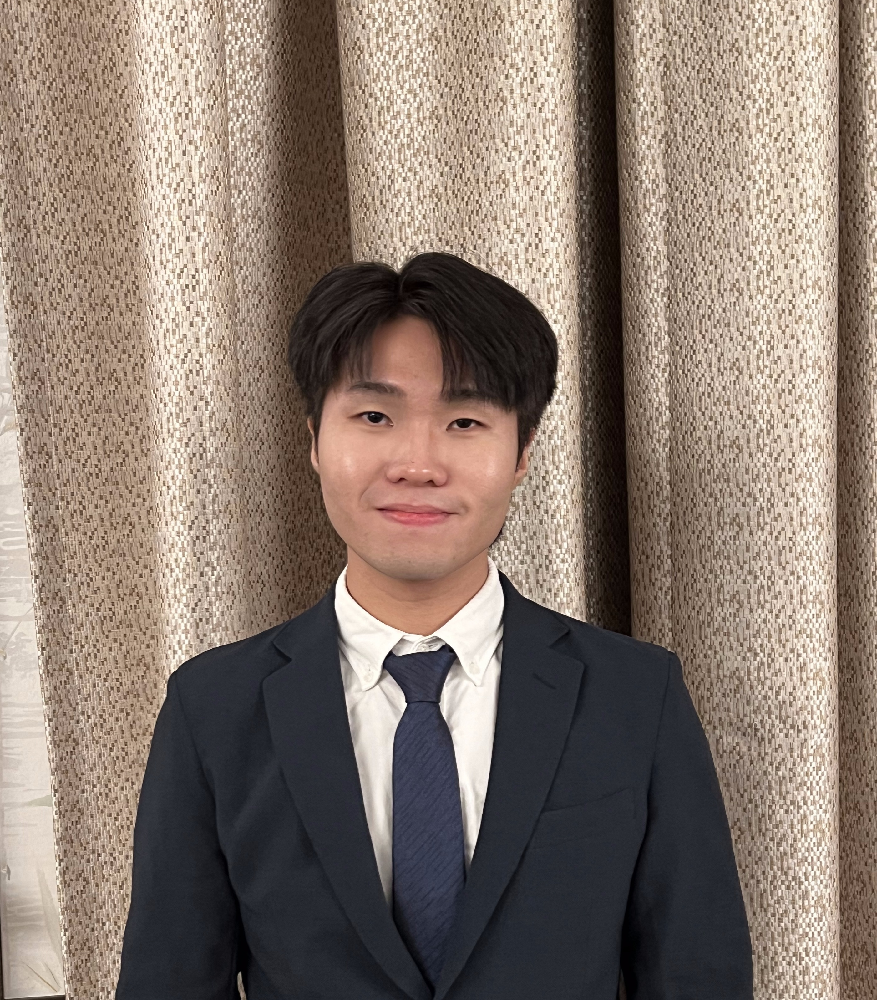
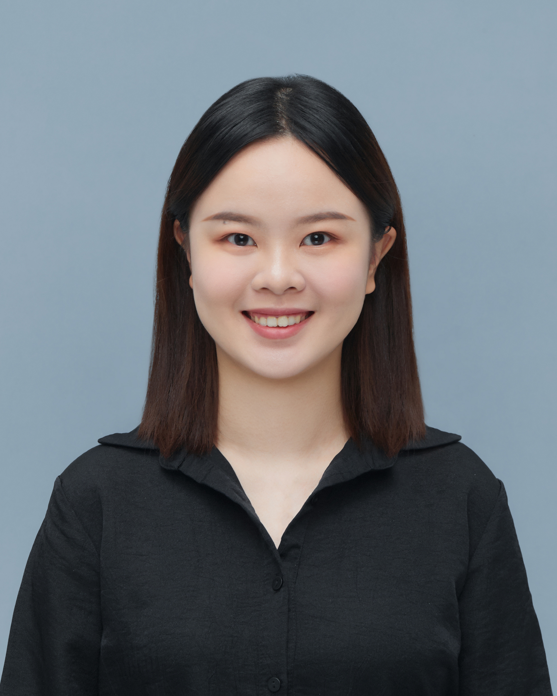

{:title "Our Team"
 :layout :page
 :page-index 1
 :navbar? true
 :to-root "../.."}

## Founder

    

        
        <h3 class="team-member-name">Dr. Matthias BUEHLMAIER</h3>
        <h2 class="team-member-position">Founder</h2>
        
Matthias Buehlmaier is a Principal Lecturer in Finance and the BBA(IBGM) Program Director at the HKU Business School (HKUBS), University of Hong Kong. He is also the Founding Director of the Centre for Investment Management at HKUBS. Buehlmaier has been a Visiting Fellow at the University of Cambridge and a Visiting Scholar at Regensburg University. His research has been published in notable journals and he has won several teaching and research awards. His interests include investment management, investment banking, mergers & acquisitions (M&A), machine learning, AI, and fintech. Buehlmaier developed and taught the world's first university course on text analytics and natural language processing in finance and fintech.

        

    

## Data Analysis Team

    

        
        <h3 class="team-member-name">Alex XU Shu Ming</h3>
        <h2 class="team-member-position">Senior Portfolio Manager, Head of Data Analysis</h2>
        
Alex is a driven sophomore of the International Business and Global Management program from the University of Hong Kong, possessing a keen interest in consulting and investment analysis. With a robust understanding of business principles, exceptional interpersonal and technical skills, and a deep passion for financial markets and quantitative strategies, he is well-prepared and eager to make a significant impact in the field of business and finance.

        

    

    

        
        <h3 class="team-member-name">Bella LIU Yiming</h3>
        <h2 class="team-member-position">Senior Portfolio Manager, Deputy Head of Data Analysis</h2>
        
LIU Yiming, Bella, a Year 2 student in BBA (Fina & ISA), is currently a deputy group leader for the Data Analysis group. Interest across American and HK stock markets. She has been looking at investments related to consumer discretionary for about 2 years and also led the Data analysis group to create a stock price prediction technique, and hopes this will help CIM as a whole.

        

    

    

        
        <h3 class="team-member-name">Anson LAM Yat Tung</h3>
        <h2 class="team-member-position">Senior Portfolio Manager</h2>
        
Anson Lam is a Quantitative Finance major student. He is interested in quantitative investing. He is also passionate about closely monitoring market trends, macro news to find inefficiency in the market and profitable trading opportunities.

        

    

    

        
        <h3 class="team-member-name">Allen JIANG Luning</h3>
        <h2 class="team-member-position">Junior Portfolio Manager</h2>
        
Allen is a sophomore Accounting Data Analytics student at the University of Hong Kong, with a keen interest in financial analysis. In her role as a junior portfolio manager and member of the data analytics team, she expects to develop her investment strategy with the support of data and analytical tools. Through this long-term program, she hopes to develop a better market sense and make more informed trading decisions in the future.

        

    

    

        
        <h3 class="team-member-name">Carlos OR King Nang</h3>
        <h2 class="team-member-position">Junior Portfolio Manager</h2>
        
King Nang is a year two student studying International Business and Global Management at the University of Hong Kong. As an amateur investor majoring in finance, he possesses a deep understanding of the intricacies of financial markets. King Nang's passion for stock trading is matched only by his fascination with business analytics. His analytical mindset and dedication to staying informed about market trends make him a promising individual in the world of finance.

        

    

    

        
        <h3 class="team-member-name">Catherine ZHAO Wenqi</h3>
        <h2 class="team-member-position">Junior Portfolio Manager</h2>
        
Catherine ZHAO Wenqi is a first-year FinTech student with a strong passion for both finance and computer science. As a newcomer to the stock market, she is eager to deepen her understanding of investment strategies and industry insights. Additionally, as a member of Data Analysis Group, she is exploring ways to integrate her programming skills into the world of investing, aiming to bridge the gap between technology and finance.

        

    

    

        
        <h3 class="team-member-name">Jonward XU Wenxuan</h3>
        <h2 class="team-member-position">Junior Portfolio Manager</h2>
        
Jonward XU Wenxuan is a Year 1 student, taking the double degree programme in Business Administration and Law. Jonward is now a junior portfolio manager in CIM. Jonward joined CIM because of interest in investment and asset management, and is now responsible for managing portfolios (mostly of energy industry), designing macro investment strategies and using programming to predict the stock price.

        

    

    

        
        <h3 class="team-member-name">Justin QIAO Yuhan</h3>
        <h2 class="team-member-position">Junior Portfolio Manager</h2>
        
Justin is a Year 2 student majoring in Marketing Analytics and Technology. He hold the position of Junior Portfolio Manager and joined the Data Analysis Group driven by a keen interest in data analysis and asset management. He enjoys analyzing complex data sets, managing portfolios, and developing investment strategies to optimize financial outcomes. Passionate about the intersection of technology and finance, Justin is eager to deepen their knowledge of programming for data analysis. He is excited to contribute to the evolving landscape of analytics and finance.

        

    

    

        
        <h3 class="team-member-name">Kelvin YUE Hohin</h3>
        <h2 class="team-member-position">Junior Portfolio Manager</h2>
        
Kelvin Yue is a Year 3 student pursuing Economics & Finance at HKU. By joining CIM, he aims to develop a comprehensive understanding of various industries and make well-informed investment decisions through collaboration. His investment approach is grounded in meticulous research, analyzing companies' operations, macro-environment, fundamentals, and technicals. Committed to continuous learning, Kelvin strives to stay ahead in the ever-evolving world of finance.

        

    

    

        
        <h3 class="team-member-name">Larina QU Hongru</h3>
        <h2 class="team-member-position">Junior Portfolio Manager</h2>
        
Qu Hongru is currently a year 1 BEcon & Fin student and a part of the Data Analysis Team at CIM. Specializing in US healthcare industry investment, she has been building her skills in industry research and stock pitching. With a keen interest in portfolio management, Qu Hongru is passionate about applying her analytical abilities to develop thoughtful investment strategies and contribute to the dynamic world of finance.

        

    

    

        
        <h3 class="team-member-name">Sophia CHENG Ka Ki</h3>
        <h2 class="team-member-position">Junior Portfolio Manager</h2>
        
Sophia is a second-year Data Science student pursuing a double major in Finance. Currently serving as a Junior Portfolio Manager within the Data Analysis team, she possesses a keen interest to deepen her knowledge of stock markets and investment management. With a focus on developing her quantitative and technical analysis skills, Sophia aspires to leverage machine learning techniques to enhance portfolio performance.

        

    

    

        
        <h3 class="team-member-name">Toby HUANG Hongbin</h3>
        <h2 class="team-member-position">Junior Portfolio Manager</h2>
        
Toby is a year 3 student from BSc(QFin), also with a double major in statistics. Toby currently serves as a junior portfolio manager at CIM and is also a part of the Data Analysis Team. Toby focuses on equity research and investment in the US real estate Industry. Joining CIM, he is eager to learn how to decide on investment strategies based on data analysis through programming. Toby regards CIM as a meaningful platform for him to get more investment skills and market sense.

        

    

    

        
        <h3 class="team-member-name">Yinsheng Yang</h3>
        <h2 class="team-member-position">Junior Portfolio Manager</h2>
        
Vincent Yang is a first-year Bachelor of Business Administration (International Business and Global Management) student at the University of Hong Kong. Passionate about finance and investment, Vincent has gained hands-on experience in investment banking, ESG research, and private equity. He has developed skills in financial modeling, equity research, and market analysis, and is eager to apply these skills to contribute to the Centre for Investment Management. Vincent is particularly interested in exploring the intersection of technology and finance, as well as sustainable investment strategies. He looks forward to collaborating with peers and mentors to deepen his understanding of global markets and investment management.

        

    

## Web Development Team

    

        
        <h3 class="team-member-name">Darren FUNG Nok Yin</h3>
        <h2 class="team-member-position">Senior Portfolio Manager, Head of Web Development</h2>
        
Darren Fung Nok Yin is a Year 3 Quantitative Finance student at The University of Hong Kong, acting as a senior portfolio manager, head of trading for financial stocks and head of the web development team. With a keen interest in the stock market and investment, he actively pursues technical and fundamental analysis, trading stocks and options as a hobby. His passion drives him to continuously expand his knowledge in these areas.

        

    

    

        
        <h3 class="team-member-name">Haley Nicholas Aidden Gotan Yap</h3>
        <h2 class="team-member-position">Senior Portfolio Manager, Deputy Head of Web Development</h2>
        
Haley Yap is a second-year Economics and Finance student from the Philippines with a deep passion for the financial sector and investments in various opportunities, ranging from stocks, ETFs, cryptocurrencies, and much more.

        

    

    

        
        <h3 class="team-member-name">Ashley LEE Juyeon</h3>
        <h2 class="team-member-position">Junior Portfolio Manager</h2>
        
Ashley Lee is a Year 2 Computer Science student with a 2nd major in Finance. Her keen interests in both fields motivated her to join CIM, an interdisciplinary approach to technology and finance. Also part of the Web Development team, she currently explores both the financial and technical aspects of CIM.

        

    

    

        
        <h3 class="team-member-name">Chuck Lam Chak Yu</h3>
        <h2 class="team-member-position">Junior Portfolio Manager</h2>
        
Lam Chak Yu, Chuck. Chuck is a Year-3 Student studying in the University of Hong Kong, double majoring Finance and Computer Science. With a strong blend of financial and technical expertise, Chuck has participated various internships and case competitions. In CIM, he was in telecommunications team and currently in technology sector team, focusing on research. He is eager to expand his knowledge and learn more in trading. He is excited about the opportunity to gain experience in investment through CIM.

        

    

    

        
        <h3 class="team-member-name">Jerry TING Kit Lam</h3>
        <h2 class="team-member-position">Junior Portfolio Manager</h2>
        
Jerry is a freshman majoring in Financial Technology, with a particular interest in wealth management and equity trading. His goal is to enhance his understanding of financial markets and develop analytical skills as a junior portfolio manager at CIM. He believes that her experience in CIM will improve his research skills and help him better formulate trade strategies using both fundamental and technical analysis.

        

    

    

        
        <h3 class="team-member-name">Joey LAI In I</h3>
        <h2 class="team-member-position">Junior Portfolio Manager</h2>
        
Joey Lai In I is currently in her second year pursuing a Bachelor of Engineering in Computer Science. She has a strong passion for problem-solving, especially in artificial intelligence and robotics. Additionally, Joey is intrigued by the stock and finance markets and is eager to delve into these areas through data analysis. At present, she is part of the web development team at CIM, where she enjoys coding and collaborating with her peers. Joey is enthusiastic about broadening her understanding of the finance industry and gaining hands-on experience in investment.

        

    

    

        
        <h3 class="team-member-name">Louise Danielle SUGIARTO</h3>
        <h2 class="team-member-position">Junior Portfolio Manager</h2>
        
Louise is a year 1 student studying BEng(DS&E). She developed strong communication, analytical, and creative skills that she's eager to bring to the team. Her investment interest started in high school, and it gave her the courage to explore the field more deeply. She's always open to learning from every experience by utilizing any given opportunity.

        

    

    

        
        <h3 class="team-member-name">Selina DENG Jiahui</h3>
        <h2 class="team-member-position">Junior Portfolio Manager</h2>
        
Selina DENG, a first-year Marketing Analysis & Technology student, is passionate about stock markets and portfolio construction. Currently serving as a junior portfolio manager at CIM, she is also actively engaged in A-share investments, where she applies analytical frameworks and tries to uncover actionable insights into evolving trends. Seeking to deepen her understanding of financial markets, she eagerly joined the CIM and remains committed to bridging academic knowledge with practical expertise, fostering growth in analytical rigor and investment acumen.

        

    

    

        
        <h3 class="team-member-name">YEO Kiah Huah</h3>
        <h2 class="team-member-position">Junior Portfolio Manager</h2>
        
Yeo is a penultimate-year student majoring in Data Science and Finance. He is highly passionate about applying technology to the financial sector. As an incoming Technology Summer Analyst at a European investment bank, Yeo aims to contribute his technological expertise and insights to CIM. His primary focus within CIM includes global technology industry research and web development.

        

    

## Research Team

    

        
        <h3 class="team-member-name">Erika LAU Tsz Yee</h3>
        <h2 class="team-member-position">Senior Portfolio Manager, Head of Research</h2>
        
Erika Lau leads the global market commentary and thematic investment analysis as the Head of Research at CIM. She has a deep passion for the intricacies of equity markets and overlooks the Consumer Staples portfolio. Erika has honed her skills through valuable internships at HSBC, Citibank and several APAC-focused hedge funds. She is a member of the class of 2025 at the University of Hong Kong, where she is specializing in finance and economics.

        

    

    

        
        <h3 class="team-member-name">Kevin XIA Yunchu</h3>
        <h2 class="team-member-position">Senior Portfolio Manager, Deputy Head of Research</h2>
        
Kevin XIA Yunchu is a senior portfolio manager in CIM, he is currently a year 2 International Business and Global Management student. Kevin is interested in the secondary market, specifically momentum and news driven trading. Besides, Kevin enjoys playing poker and bouldering during his free time.

        

    

    

        
        <h3 class="team-member-name">Dacian DENG Shen</h3>
        <h2 class="team-member-position">Senior Portfolio Manager</h2>
        
DENG Shen Dacian is a third-year BSc(QFin) student with a keen interest in equity investment. Currently serving as a senior portfolio manager at CIM, Shen is eager to enhance his understanding of equity investment through his association with CIM. Shen views CIM as an invaluable platform that offers him the opportunity to expand his knowledge in this field.

        

    

    

        
        <h3 class="team-member-name">Jonathan CHEN Junliang</h3>
        <h2 class="team-member-position">Senior Portfolio Manager</h2>
        
Double majoring in Economics and Computer science has equipped me with the ability to conduct in-depth macro fundamental analysis and a solid coding skill set. I am interesed in quantitative research, to combine financial insights with technical capabilities and o analyze market trends from multiple perspectives and develop data-driven strategies for investment and financial analysis.

        

    

    

        
        <h3 class="team-member-name">Alexander Antoniou</h3>
        <h2 class="team-member-position">Junior Portfolio Manager</h2>
        
Alec Antoniou is a multinational, results-driven student, leveraging his engineering background to identify and capitalize on strategic investment opportunities. With experience in fintech and corporate banking, he currently applies a data-driven, analytical approach to investment strategy in the Utilities team at CIM. His focus lies in energy and infrastructure banking across EMEA and emerging markets.

        

    

    

        
        <h3 class="team-member-name">Charles SHI Qiyuan</h3>
        <h2 class="team-member-position">Junior Portfolio Manager</h2>
        
Charles Shi, a Year 1 student majoring in Economics and Finance, is driven by a passion for applying in-depth knowledge in investment analysis. As part of the Research Team, he maintains a high degree of sensitivity to the financials equities and to emerging markets, such as India. Constantly refined analysis skills enables him to efficiently extract key information from dynamic data, demonstrating the potential for capturing investment opportunities and making data-driven decisions.

        

    

    

        
        <h3 class="team-member-name">David LU Zhiyuan</h3>
        <h2 class="team-member-position">Junior Portfolio Manager</h2>
        
David Lu Zhiyuan is a Year 2 Computer Engineering student with a minor in Finance. Zhiyuan currently serves as a junior portfolio manager at CIM and is also a part of the research group. With strong analytical and problem-solving skills from his engineering background, he is eager to apply quantitative approaches to investment research and financial modelling. Through CIM, he hopes to refine his market analysis skills, gain exposure to different asset classes, and build a solid foundation for a future career in finance.

        

    

    

        
        <h3 class="team-member-name">Justin CHUNG Lok Yin</h3>
        <h2 class="team-member-position">Junior Portfolio Manager</h2>
        
Justin CHUNG Lok Yin, BFin (AMPB) III, specializes in the Utilities sector and Indian market research for CIM. With internships in Raffles Family Office, Safari Asia Asset Management and Teneo Financial Advisory, Justin has honed his analytical mindset and investment expertise. A proponent of value investing, fundamental analysis and long-termism, Justin welcomes opportunities to exchange experiences with new connections in the financial industry.

        

    

    

        
        <h3 class="team-member-name">Kathy TAM Ka Ioi</h3>
        <h2 class="team-member-position">Junior Portfolio Manager</h2>
        
Kathy is a dedicated finance student with a strong interest in equity research and portfolio management. As a Junior Portfolio Manager, she leverages her analytical skills and passion for financial markets to identify investment opportunities and manage risk. Kathy thrives in collaborative environments and is committed to delivering value-driven insights to support informed decision-making and optimize portfolio performance.

        

    

    

        
        <h3 class="team-member-name">Rachel HU Xinyue</h3>
        <h2 class="team-member-position">Junior Portfolio Manager</h2>
        
Rachel Hu is a first-year Economics & Finance student with a strong interest in the stock market and investment strategies. As part of the research team at the Centre for Investment Management, she monitors market trends, tracks macroeconomic shifts, and analyzes investment opportunities. Though new to finance, she is eager to apply her skills and contribute meaningful insights. Committed to continuous learning, she aims to develop market intuition and make informed investment decisions in the future.

        

    

    

        
        <h3 class="team-member-name">Robin HONG Yee Ching</h3>
        <h2 class="team-member-position">Junior Portfolio Manager</h2>
        
Robin Hong Yee Ching is a junior portfolio manager in CIM, he is currently a year 2 International Business and Global Management student from the University of Hong Kong. Robin is interested in both traditional trading and investment analysis. He's well-prepared with interpersonal and technical skills, and eager to make a significant impact at CIM.

        

    

    

        
        <h3 class="team-member-name">Sarah LEONG Si Ian</h3>
        <h2 class="team-member-position">Junior Portfolio Manager</h2>
        
Sarah is a Year 1 student majoring in Economics and Finance, passionate about aquiring practical skills in stock portfolio management and conducting thorough market research. With a solid business background, she aims to effectively integrate her theoretical knowledge into real-life scenarios while gaining valuable hands-on experience and insights in managing diverse investment portfolios.

        

    

 

