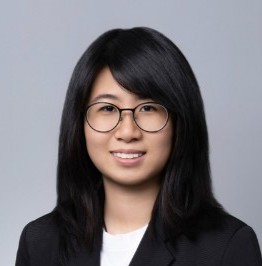

{:title "Our Team"
 :layout :page
 :page-index 1
 :navbar? true
 :to-root "../.."}

## Founder

    

        
        <h3 class="team-member-name">Dr. Matthias BUEHLMAIER</h3>
        <h2 class="team-member-position">Founder</h2>
        

            
View Description

            
Matthias Buehlmaier is a Principal Lecturer in Finance and the BBA(IBGM) Program Director at the HKU Business School (HKUBS), University of Hong Kong. He is also the Founding Director of the Centre for Investment Management at HKUBS. Buehlmaier has been a Visiting Fellow at the University of Cambridge and a Visiting Scholar at Regensburg University. His research has been published in notable journals, and he has won several teaching and research awards. His interests include investment management, investment banking, mergers & acquisitions (M&A), machine learning, AI, and fintech. Buehlmaier developed and taught the world's first university course on text analytics and natural language processing in finance and fintech.

        

        

    

## Data Analysis Team

    

        
        <h3 class="team-member-name">Larina QU Hongru</h3>
        <h2 class="team-member-position">Senior Portfolio Manager, Head of Data Analysis 2025-26</h2>
        
Joined Academic Year 2024-25

        
Qu Hongru is currently a BEcon & Fin student and a part of the Data Analysis Team at CIM. Specializing in the US healthcare industry investment, she has been building her skills in industry research and stock pitching. With a keen interest in portfolio management, Qu Hongru is passionate about applying her analytical abilities to develop thoughtful investment strategies and contribute to the dynamic world of finance.

        

    

    

        
        <h3 class="team-member-name">Allen JIANG Luning</h3>
        <h2 class="team-member-position">Senior Portfolio Manager, Deputy Head of Data Analysis 2025-26</h2>
        
Joined Academic Year 2024-25

        
Allen is an Accounting Data Analytics student at the University of Hong Kong, with a keen interest in financial analysis. In her role as a junior portfolio manager and member of the data analytics team, she expects to develop her investment strategy with the support of data and analytical tools. Through this long-term program, she hopes to develop a better market sense and make more informed trading decisions in the future.

        

    

    

        
        <h3 class="team-member-name">Jonward XU Wenxuan</h3>
        <h2 class="team-member-position">Senior Portfolio Manager</h2>
        
Joined Academic Year 2024-25

        
Jonward XU Wenxuan is a student taking the double degree programme in Business Administration and Law. Jonward is now a senior portfolio manager in CIM. Jonward joined CIM because of his interest in investment and asset management, and is now responsible for managing portfolios (mostly of the energy industry), designing macro investment strategies and using programming to predict the stock price.

        

    

    

        
        <h3 class="team-member-name">Kelvin YUE Hohin</h3>
        <h2 class="team-member-position">Senior Portfolio Manager</h2>
        
Joined Academic Year 2024-25

        
Kelvin Yue is a student pursuing Economics & Finance at HKU. By joining CIM, he aims to develop a comprehensive understanding of various industries and make well-informed investment decisions through collaboration. His investment approach is grounded in meticulous research, analyzing companies' operations, macro-environment, fundamentals, and technicals. Committed to continuous learning, Kelvin strives to stay ahead in the ever-evolving world of finance.

        

    

    

        
        <h3 class="team-member-name">Sophia CHENG Ka Ki</h3>
        <h2 class="team-member-position">Senior Portfolio Manager</h2>
        
Joined Academic Year 2024-25

        
Sophia is a Data Science student pursuing a second major in Finance. She is committed to exploring financial markets and investment management through a data-driven and analytical approach. Her interests lie in developing quantitative research skills and utilizing machine learning techniques to generate investment insights and optimize portfolio performance.

        

    

    

        
        <h3 class="team-member-name">Selina DENG Jiahui</h3>
        <h2 class="team-member-position">Senior Portfolio Manager</h2>
        
Joined Academic Year 2024-25

        
Deng Jiahui is an economics and finance student with a strong interest in macro investing, portfolio management, and multi-asset allocation. She gains practical experience as a senior portfolio manager at CIM and through her own A-share investments. Her goal is to continuously integrate academic learning with hands-on practice to enhance her analytical and investment capabilities.

        

    

     

        
        <h3 class="team-member-name">Aryan GUPTA MANCHANDA</h3>
        <h2 class="team-member-position">Junior Portfolio Manager</h2>
        
Joined Academic Year 2025-26

        
Aryan is a student pursuing Economics and Finance, driven by a natural curiosity of the mechanisms of financial markets. As a member of the Data Analysis team at CIM, he utilises analytical tools to transform raw data into actionable insights which directly enhance portfolio performance. He is eager to continue developing his analytical skills and contribute to data driven decision making, aiding investment strategies in the future.

        

    

    

        
        <h3 class="team-member-name">Rishabh KHANNA</h3>
        <h2 class="team-member-position">Junior Portfolio Manager</h2>
        
Joined Academic Year 2025-26

        
Rishabh Khanna is currently a Quantitative Finance student, driven by his passion and commitment towards gaining knowledge and creating consequential change. In his role as a Junior Portfolio Manager specialising in Materials Industry investment, he has built skills in monitoring industry fluctuations and applying fundamental and technical analysis to predict stock trends. Within the Data Analysis Team, he hopes to enhance his market strength and gain further experience working with specialised methodologies and programming to deduce market movements and optimise data-backed responses to take full advantage of investment opportunities.

        

    

    

        
        <h3 class="team-member-name">Louis LU Yiyang</h3>
        <h2 class="team-member-position">Junior Portfolio Manager</h2>
        
Joined Academic Year 2025-26

        
Louis LU Yiyang is a BEcon&Fin student with a double major in computer science. He is a part of CIM data analysis team. As a junior portfolio manager, he is mainly reponsible for investment of financials industry. Passionate about portfolio management and technology‑driven investing, he hopes to apply his analytical abilitie to real-world investment,   contributing to the CIM group's performances.

        

    

      

        
        <h3 class="team-member-name">Aryan ARORA</h3>
        <h2 class="team-member-position">Junior Portfolio Manager</h2>
        
Joined Academic Year 2025-26

        
Aryan Arora is an undergraduate student majoring in Economics and Finance, with a strong passion for financial markets, investment strategy, and quantitative modeling. He serves as a Junior Portfolio Manager at CIM, where he applies analytical and research skills to support portfolio management initiatives. Fascinated by how data and economics drive real-world financial decisions, Aryan continually seeks to deepen his understanding of global markets and innovative financial solutions that create sustainable impact.

        

    

    

        
        <h3 class="team-member-name">Lena Liv Emma DELAFONTENELLE</h3>
        <h2 class="team-member-position">Junior Portfolio Manager</h2>
        
Joined Academic Year 2025-26

        
Lena is a student in the dual degree programme between Sciences Po Paris and the University of Hong Kong, majoring in Finance at HKU. She joined the Centre for Investment Management (CIM) because of her interest in investment management. At CIM, Lena has the opportunity to work on investment projects, manage portfolios, and deepen her understanding of investment strategies. Her aim as a junior portfolio manager is to learn more about financial markets, improve her market sense, and become more knowledgeable about investment strategies. She is eager to contribute to CIM with her skills and knowledge.

        

    

    

        
        <h3 class="team-member-name">Rebecca LI Jiarui</h3>
        <h2 class="team-member-position">Junior Portfolio Manager</h2>
        
Joined Academic Year 2025-26

        
Rebecca LI Jiarui is an Accounting and Finance student at the University of Hong Kong and a member of the Data Analysis Team at CIM. Serving as a Junior Portfolio Manager, she is deeply enthusiastic about investment management. Through this program, she aims to develop highly practical skills in data analytics to formulate strategic investment recommendations, as well as to build up her collaborative abilities and teamwork within a professional setting. 

        

    

    

        
        <h3 class="team-member-name">LEE Cheuk Lun</h3>
        <h2 class="team-member-position">Junior Portfolio Manager</h2>
        
Joined Academic Year 2025-26

        
Felix is a dedicated Year 2 student pursuing a Bachelor of Business Administration in International Business and Global Management (BBA IBGM). Currently serving as a junior portfolio manager in the data analytics team, he possesses a strong passion for quantitative finance and asset management. Felix is eager to leverage data analytics to backtest and develop innovative investment strategies. His analytical mindset and commitment to understanding market dynamics drive him to excel in his studies and professional endeavors, as he aims to explore new avenues in finance and contribute to the evolving landscape of the industry.

        

    
 
    

        
        <h3 class="team-member-name">Sophie NG Shui Yee</h3>
        <h2 class="team-member-position">Junior Portfolio Manager</h2>        
        
Joined Academic Year 2025-26

        
Sophie is a student majoring in both Bachelor of Business Administration (International Business and Global Management) and Finance at the University of Hong Kong. Passionate about investments, Sophie has gained hands-on experience in M&A research analysis and stock trading through working at a brokerage firm. With a strong analytical and research background, Sophie is particularly interested in honing her skills on data analysis with Python and building different financial models to make more rational financial investments through quantitative means in the CIM. 

        

    

    

        
        <h3 class="team-member-name">Josephine Marcela CHRISTANTY</h3>
        <h2 class="team-member-position">Junior Portfolio Manager</h2>        
        
Joined Academic Year 2025-26

        
Cella is an Asset Management and Private Banking student pursuing a second major in Global and Area Studies. Serving as a junior portfolio manager in the data analysis group, she hopes to deepen her financial knowledge and develop the analytical abilities needed to perform better trades and investments.

        

    

    

        
        <h3 class="team-member-name">Michael JI Yuxiao</h3>
        <h2 class="team-member-position">Junior Portfolio Manager</h2>        
        
Joined Academic Year 2025-26

        
Michael Ji is a Quantitative Finance student at the University of Hong Kong with hands-on experience as a junior portfolio manager at the Center for Investment Management. Passionate about quantitative analysis and technical trading, he actively contributes to the Healthcare Team, where he sharpens his investment acumen through research and strategy development. Michael is committed to continuous learning and skill enhancement, leveraging real-world exposure to deepen his understanding of financial markets and portfolio management.

        

    

    

        
        <h3 class="team-member-name">Jason LIN Shu Kuen</h3>
        <h2 class="team-member-position">Junior Portfolio Manager</h2>        
        
Joined Academic Year 2025-26

        
Jason Lin is a Fintech and Finance double major student at HKU. He is a junior portfolio manager in the data analysis group who specialises in real estate. By joining CIM, he hopes to broaden his understanding of diverse asset classes and sharpen his analytical skills through exposure to real‑world investment strategies. Jason aims to leverage this experience to enhance his portfolio management capabilities and contribute meaningfully to the team’s research and decision‑making processes.

        

    

    

        
        <h3 class="team-member-name">Cici WANG Siqi</h3>
        <h2 class="team-member-position">Junior Portfolio Manager</h2>
        
Joined Academic Year 2025-26

        
Cici is a student majoring in Economics and Finance at the University of Hong Kong, with a keen interest in financial analysis and investment. With an interdisciplinary background in business and computer science, and as a junior portfolio manager and a member in the data analysis team, she is interested in using programming and data analyzing skills to facilitate investment decision making and to gain insight into the developing new investment strategies.

        

    

    

        
        <h3 class="team-member-name">Patrick TSANG Chun Shing</h3>
        <h2 class="team-member-position">Junior Portfolio Manager</h2>
        
Joined Academic Year 2025-26

        
Patrick is a Quantitative Finance student with a strong passion for investing and financial analysis. As a member of the Data Analysis Team at CIM, he is focused on developing his skills in data-driven research and equity valuation. With a keen interest in quantitative modeling and portfolio construction, he aims to apply rigorous analytical techniques to uncover investment opportunities. Through collaborative learning and hands-on experience, he strives to deepen his understanding of financial markets and contribute meaningfully to the team’s investment strategies.

        

    

    

          
          <h3 class="team-member-name">Kitty YE Yingqi</h3>
          <h2 class="team-member-position">Junior Portfolio Manager</h2>
          
Joined Academic Year 2025-26

          
Kitty Ye is a Junior Portfolio Manager in the Data Analysis team at CIM, currently majoring in Quantitative Finance. Passionate about applying quantitative models and computational methods to financial markets, she focuses on developing data-driven investment strategies to analyze trends and assess risks. By leveraging statistical techniques and programming, Kitty aims to enhance portfolio performance and deliver actionable insights to support the team’s strategic decision-making.

          

    

    

          
          <h3 class="team-member-name">Jason CHUNG Ka Ho</h3>
          <h2 class="team-member-position">Junior Portfolio Manager</h2>
          
Joined Academic Year 2025-26

          
Jason is a student majoring in Quantitative Finance, currently serving as a Junior Portfolio Manager within the Data Analysis Team at CIM. With a specialized focus on the energy sector, he is dedicated to honing his skills in quantitative analysis and equity valuation. Michael is passionate about leveraging programming and data-driven insights to build robust financial models and develop strategic investment theses. He is committed to continuous learning in the dynamic field of finance and aims to contribute meaningfully to portfolio performance through his analytical rigor.

          

    

    

          
          <h3 class="team-member-name">Lukas YIN Yat</h3>
          <h2 class="team-member-position">Junior Portfolio Manager</h2>
          
Joined Academic Year 2025-26

          
Lukas is currently pursuing EDI, Law, and Economics at HKU. He is now a junior portfolio manager in the materials sector and a member of the data analytics team. He is passionate about finance with a solid foundation in various disciplines and looks forward to crafting investment approaches aided by data and analytical instruments. By being a part of CIM, he seeks to build a keener market awareness and execute more strategic trades.

          

    

 

## Web Development Team

    

        
        <h3 class="team-member-name">Ashley LEE Juyeon</h3>
        <h2 class="team-member-position">Senior Portfolio Manager, Head of Web Development 2025-26</h2>        
        
Joined Academic Year 2024-25

        
Ashley Lee is a Computer Science student with a 2nd major in Finance. Her keen interests in both fields motivated her to join CIM, an interdisciplinary approach to technology and finance. Also part of the Web Development team, she currently explores both the financial and technical aspects of CIM. 

        

    

   

         
         <h3 class="team-member-name">Louise Danielle SUGIARTO</h3>
         <h2 class="team-member-position">Senior Portfolio Manager, Deputy Head of Web Development 2025-26</h2>
         
Joined Academic Year 2024-25

         
Louise is a student studying BEng(DS&E). She developed strong communication, analytical, and creative skills that she's eager to bring to the team. Her investment interest started in high school, and it gave her the courage to explore the field more deeply. She's always open to learning from every experience by utilizing any given opportunity.

         

     

    

        
        <h3 class="team-member-name">Joey LAI In I</h3>
        <h2 class="team-member-position">Senior Portfolio Manager</h2>
        
Joined Academic Year 2024-25

        
Joey Lai In I is a student pursuing a Bachelor of Engineering in Computer Science. She has a strong passion for problem-solving, especially in artificial intelligence and robotics. Additionally, Joey is intrigued by the stock and finance markets and is eager to delve into these areas through data analysis. At present, she is part of the web development team at CIM, where she enjoys coding and collaborating with her peers. Joey is enthusiastic about broadening her understanding of the finance industry and gaining hands-on experience in investment.

        

    

    

        
        <h3 class="team-member-name">Nicholas FEDLIM</h3>
        <h2 class="team-member-position">Junior Portfolio Manager</h2>
        
Joined Academic Year 2025-26

        
Nicholas Fedlim, a Data Science student pursuing a double major in Finance, is passionate about acquiring practical skills in stock portfolio management. As a Junior Portfolio Manager in CIM, he aims to bridge his theoretical knowledge with real-world investment scenarios. He further supports this data-driven mission on the Web Development team, where he applies his programming skills to maintain and enhance the CIM’s digital platforms. He is committed to bridging his technical expertise with financial awareness to contribute to the team's analytical rigor. 

        

    

     

        
        <h3 class="team-member-name">Hannah MYAT Su Mon</h3>
        <h2 class="team-member-position">Junior Portfolio Manager</h2>
        
Joined Academic Year 2025-26

        
Hannah is pursuing a Bachelor of Engineering in Computer Science. With a strong interest in both technology and finance, she aims to apply her engineering and programming skills to data-driven financial analysis and investment. Currently serving as a junior portfolio manager and a member of web development team at CIM, she aims to broaden her understanding of finance, strengthen her analytical mindset, and gain practical experience in both investment and web development. 

        

    

    

        
        <h3 class="team-member-name">Henry LI Yan Heng</h3>
        <h2 class="team-member-position">Junior Portfolio Manager</h2>
        
Joined Academic Year 2025-26

        
Henry is a student pursuing a Bachelor of Finance in Asset Management and Private Banking. He is a critical thinker who has a strong passion for problem-solving, the stock market and portfolio construction. With the aim of learning more about the financial markets and applying his theoretical knowledge to real-life scenarios, he joined CIM. 

        

    

    

        
        <h3 class="team-member-name">Sean REN Xuxiang</h3>
        <h2 class="team-member-position">Junior Portfolio Manager</h2>
        
Joined Academic Year 2025-26

        
Sean Ren is a second-year Bachelor of Arts and Science student double majoring in Financial Technology and Computer Science. With a solid foundation in software engineering and database management, he combines technical expertise with analytical thinking. Deeply interested in both Computer Science and Finance, he actively seeks opportunities to contribute to innovative projects in both fields. 

        

    

        

        
        <h3 class="team-member-name">Carrie CHAN Tsz Tung</h3>
        <h2 class="team-member-position">Junior Portfolio Manager</h2>
        
Joined Academic Year 2025-26

        
Carrie is currently a student majoring in Accounting and Finance at HKU. She joined CIM because of her keen interest in investment and her desire to explore more in the finance field. She is passionate about enhancing her investing skills and gaining practical experience in finance. Her eagerness to further understand investment strategies makes CIM an ideal fit for her aspirations. 

        

    

    

        
        <h3 class="team-member-name">Arya RAJESH</h3>
        <h2 class="team-member-position">Junior Portfolio Manager</h2>
        
Joined Academic Year 2025-26

        
Arya is a double degree student pursuing Computer Engineering and Finance at the University of Hong Kong. She joined The Center for Investment Management to deepen her understanding of the markets and apply her skills in a real-world context. She is eager to learn more about fintech integration and data analysis in investment management while contributing her technical skills to support CIM and grow her abilities in a practical setting. 

        

    

## Research Team

   

          
          <h3 class="team-member-name">Charles SHI Qiyuan</h3>
          <h2 class="team-member-position">Senior Portfolio Manager, Head of Research 2025-26</h2>
          
Joined Academic Year 2024-25

          
Charles Shi, a student majoring in Economics and Finance, is driven by a passion for applying in-depth knowledge in investment analysis. As part of the Research Team, he maintains a high degree of sensitivity to the financial equities and to emerging markets, such as India. Constantly refined analysis skills enable him to efficiently extract key information from dynamic data, demonstrating the potential for capturing investment opportunities and making data-driven decisions.

          

    

    

        
        <h3 class="team-member-name">Sarah LEONG Si Ian</h3>
        <h2 class="team-member-position">Senior Portfolio Manager, Deputy Head of Research 2025-26</h2>
        
Joined Academic Year 2024-25

        
Sarah is a student majoring in Economics and Finance, passionate about acquiring practical skills in stock portfolio management and conducting thorough market research. With a solid business background, she aims to effectively integrate her theoretical knowledge into real-life scenarios while gaining valuable hands-on experience and insights in managing diverse investment portfolios.

        

    

    

        
        <h3 class="team-member-name">Rachel HU Xinyue</h3>
        <h2 class="team-member-position">Senior Portfolio Manager</h2>
        
Joined Academic Year 2024-25

        
Rachel Hu is a Quantitative Finance student with a strong interest in the stock market and investment strategies. As part of the research team at the Centre for Investment Management, she monitors market trends, tracks macroeconomic shifts, and analyzes investment opportunities. Though new to finance, she is eager to apply her skills and contribute meaningful insights. Committed to continuous learning, she aims to develop market intuition and make informed investment decisions in the future.

        

    

    

        
        <h3 class="team-member-name">Justin CHUNG Lok Yin</h3>
        <h2 class="team-member-position">Senior Portfolio Manager</h2>
        
Joined Academic Year 2024-25

        
Justin CHUNG Lok Yin, BFin (AMPB), specializes in the Utilities sector and Indian market research for CIM. With internships in Raffles Family Office, Safari Asia Asset Management and Teneo Financial Advisory, Justin has honed his analytical mindset and investment expertise. A proponent of value investing, fundamental analysis and long-termism, Justin welcomes opportunities to exchange experiences with new connections in the financial industry.

        

    

    

        
        <h3 class="team-member-name">Mabel LOK Ka Ying</h3>
        <h2 class="team-member-position">Junior Portfolio Manager</h2>
        
Joined Academic Year 2025-26

        
Mabel is currently majoring in Asset Management and Private Banking, eager to explore the finance industry, with profolio management being a main focus.  By facing real-life market scenarios, she hopes to gain practical experience in researching and applying various investment strategies, and collect insights in investing in different industries on the stock market.

        

    

    

        
        <h3 class="team-member-name">Daisy DAI Yingxi</h3>
        <h2 class="team-member-position">Junior Portfolio Manager</h2>
        
Joined Academic Year 2025-26

        
Daisy DAI is a dedicated Accounting and Finance student driven by a strong passion for applying analytical skills to evaluate investment opportunities and assess corporate health. As a Junior Portfolio Manager of the Research Team, she demonstrates a keen eye for details when analysing complex financial data and is adept at performing rigorous financial modelling. Committed to continuous learning, Daisy excels at translating detailed financial information into actionable insights, aiming to make well-supported, data-driven decisions in a dynamic market environment and contribute a fresh, analytical perspective.

        

    

    

        
        <h3 class="team-member-name">Cathy TAM Tsz Ching</h3>
        <h2 class="team-member-position">Junior Portfolio Manager</h2>
        
Joined Academic Year 2025-26

        
Cathy is a BBA (IBGM) student at the University of Hong Kong. She oversees the Telecommunications portfolio and works closely with peers to conduct weekly analyses of the telecommunications market and stock trends. In addition, as a dedicated member of the Research Team, she is actively expanding her skills and knowledge in stock analysis, equity research and report writting. 

        

    

    

        
        <h3 class="team-member-name">William ZHANG Jiahua</h3>
        <h2 class="team-member-position">Junior Portfolio Manager</h2>
        
Joined Academic Year 2025-26

        
William is currently a year one Quantitative Finance student at the University of Hong Kong. He is a junior portfolio manager in the research group, developing his research skills, with an interest in understanding the US stock market. William also aspires to practice portfolio risk management skills in his industry group, real estate, while exploring different investment tools such as derivatives and funds. With these hands-on experiences, he hopes to contribute to CIM by providing useful research insights shaped by his ability to tell a meaningful story from numbers and data.

        

    

    

        
        <h3 class="team-member-name">Emilie POU Ho Yuet</h3>
        <h2 class="team-member-position">Junior Portfolio Manager</h2>
        
Joined Academic Year 2025-26

        
Emilie is a motivated student taking the BBA(Law)&LLB double-degree program. She is interested in investment management and passionate to learn about the financial market. As a member of the research team, she is also constantly following news and trends in finance, as well as learning to be a better investor and portfolio manager.

        

    

    

        
        <h3 class="team-member-name">Adrian PING An</h3>
        <h2 class="team-member-position">Junior Portfolio Manager</h2>
        
Joined Academic Year 2025-26

        
Adrian Ping is a BBA student majoring in Finance. He specializes in equity research and data-driven investment analysis, with experience developing investment theses, building financial models, and synthesizing insights from dynamic market data. He has led multiple research and consulting projects, demonstrating strong analytical rigor and the ability to integrate qualitative judgment with quantitative validation. Curious and intellectually driven, he continuously deepens his market understanding and refines disciplined research frameworks to support disciplined portfolio decisions.

        

     

     

        
        <h3 class="team-member-name">Tiffany ZHANG Difei</h3>
        <h2 class="team-member-position">Junior Portfolio Manager</h2>
        
Joined Academic Year 2025-26

        
Tiffany Zhang, a FinTech student at the University of Hong Kong and a Junior Portfolio Manager at CIM, is dedicated to the industrials industry. Functionally focused on research, she thrives on deep analytical tasks to uncover investment opportunities and support portfolio strategy. She is driven by a profound curiosity and a desire to learn continuously, aiming to build a career in investment management grounded in rigorous, research-based analysis.

        

     

     

        
        <h3 class="team-member-name">Lucy ZHOU Zihan</h3>
        <h2 class="team-member-position">Junior Portfolio Manager</h2>
        
Joined Academic Year 2025-26

        
Lucy Zhou is an Economics and Finance student at the University of Hong Kong. As a junior portfolio manager at CIM, she is eager to learn how to conduct in-depth analysis of the stock market and enhance her investment management skills. Lucy is now a part of the research team and is also responsible for tracking industrial stocks. She is willing to integrate her knowledge of economics and finance with real-world stock market movements to contribute to the team, sharing her insights into the stock market and learning from others’ unique and profound perspectives.

        

      

      

        
        <h3 class="team-member-name">April WANG Chang</h3>
        <h2 class="team-member-position">Junior Portfolio Manager</h2>
        
Joined Academic Year 2025-26

        
April Wang Chang is a student majoring in Business Analytics at the University of Hong Kong. With hands-on experience in equity research and stock pitch competitions, she has developed a strong passion for investment and trading. Currently serving in the research function group at the Centre for Investment Management, she actively seeks to exchange insights with fellow members, deepen her industry knowledge, and refine her analytical skills through collaborative learning.

        

      
 
       

        
        <h3 class="team-member-name">Ling GUO Yuling</h3>
        <h2 class="team-member-position">Junior Portfolio Manager</h2>
        
Joined Academic Year 2025-26

        
Guo Yuling is currently a BEcon & Fin student and a member of the Research Team at CIM. With a solid background in industry research and stock pitching, she has developed a strong interest and practical experience in asset allocation and portfolio management through her participation in various finance-focused summer camps. These experiences have not only honed her analytical and strategic thinking skills but also deepened her passion for the dynamic field of investment management. Guo Yuling is eager to continue exploring opportunities in portfolio management and is committed to applying her expertise to contribute meaningfully to the finance industry.

        

      
 
      

         
         <h3 class="team-member-name">Vicky HUANG Lihan</h3>
         <h2 class="team-member-position">Junior Portfolio Manager</h2>        
         
Joined Academic Year 2025-26

         
Huang Lihan is a dedicated BBA student specializing in Finance, with an interest in developing practical expertise in equity portfolio management and in-depth market analysis. Equipped with a solid foundation in business and finance, she aims to seamlessly apply academic insights to real-world investment scenarios. Through hands-on experience as a junior portfolio manager, Huang Lihan is committed to refining her analytical skills and deepening her understanding of managing diversified investment portfolios.

         

     

     

        
        <h3 class="team-member-name">Arman ABILKASSYM</h3>
        <h2 class="team-member-position">Junior Portfolio Manager</h2>
        
Joined Academic Year 2025-26

        
Arman Abilkassym, a first-year Economics and Finance student, is actively pursuing his passion for investments as a Junior Portfolio Manager at CIM. He is keenly focused on bridging the gap between theoretical finance and practical application. By analyzing market trends, evaluating potential assets, and assisting in the management of investment portfolios, Arman is rapidly acquiring the skills and insights necessary for a successful career in financial markets.

        

    

    

        
        <h3 class="team-member-name">Matthew SZE-TO Chun Yin</h3>
        <h2 class="team-member-position">Junior Portfolio Manager</h2>
        
Joined Academic Year 2025-26

        
Sze-to Chun Yin is a student taking the business administration and law. Matthew joined CIM as a junior portfolio manager, aiming to learn more about world markets and investment. He is now responsible for managing portfolios, mostly for the technological industry. He is also part of the research group, constantly studying market trends and industries. Matthew hopes to be able to become a consistent contributor to gain more hands-on experience in investment.

        

    

    

          
          <h3 class="team-member-name">Doraa HE Xu</h3>
          <h2 class="team-member-position">Junior Portfolio Manager</h2>
          
Joined Academic Year 2025-26

          
He Xu Doraa is an Economics and Finance student with a strong passion for the stock market and investment strategy. Her quantitative analysis skill is honed by a minor in mathematics and a research analyst internship. As the junior portfolio manager of the healthcare group, she is eager to leverage her rigorous financial acumen and analytical skills to identify and evaluate investment opportunities.

          

    

    

          
          <h3 class="team-member-name">Molly LIU Litong</h3>
          <h2 class="team-member-position">Junior Portfolio Manager</h2>
          
Joined Academic Year 2025-26

          
Molly is a sophomore majoring in Quantitative Finance, whose passion lies in industry research and stock pitching. She has set a clear career goal of pursuing a role in investment banking—an ambition supported by her strong academic foundation spanning Mathematics, Programming, Statistics, and Finance. Leveraging this interdisciplinary background, she is actively honing practical skills critical to her target field, including data analysis, rigorous stock pitching, and other core competencies for financial markets.

          

    

    

          
          <h3 class="team-member-name">Diana LIU Haolin</h3>
          <h2 class="team-member-position">Junior Portfolio Manager</h2>
          
Joined Academic Year 2025-26

          
Liu Haolin, Diana, a HKU BBA student major in Finance, is currently a Junior Portfolio Manager in the Research Team at the Center of Investment Management. She is interested in exploring how data and market trends shape investment decisions. By analyzing company fundamentals and economic indicators, she aims to develop a clearer understanding of portfolio construction and risk management. Through teamwork and research practice, she continues to strengthen her analytical mindset and interest in investment management.

          

    

    

          
          <h3 class="team-member-name">Jackie LUI Ching Ho</h3>
          <h2 class="team-member-position">Junior Portfolio Manager</h2>
          
Joined Academic Year 2025-26

          
Jackie is an Accounting and Finance student with a great interest in investing, trading, and portfolio management. As a Junior Portfolio Manager at CIM, he focuses on the consumer discretionary sector, actively managing investment portfolios through in-depth fundamental analysis and market trends. Jackie also conducts regular research on macroeconomic indicators and corporate financials to provide investment insights and market news. His practical experience in portfolio construction and market analysis, in addition to his passion for financial markets, demonstrates his ability to excel in the finance industry.

          

    

    

 

