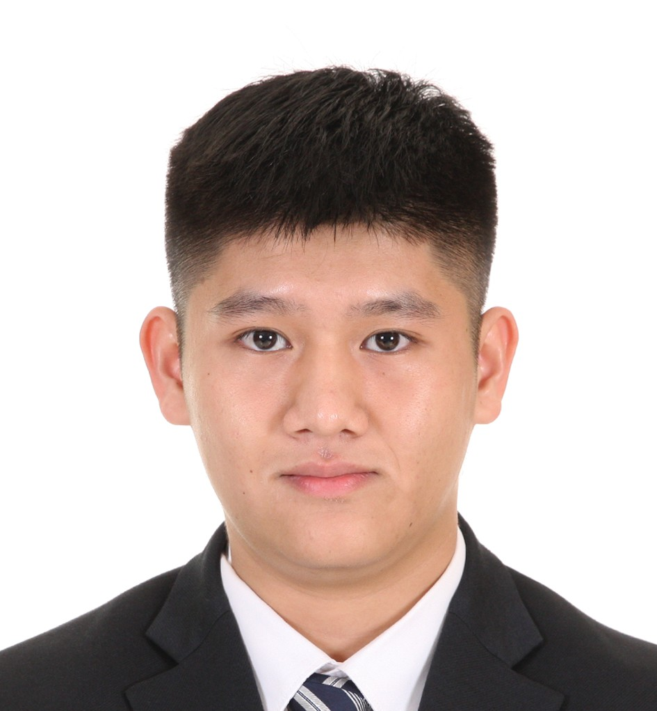
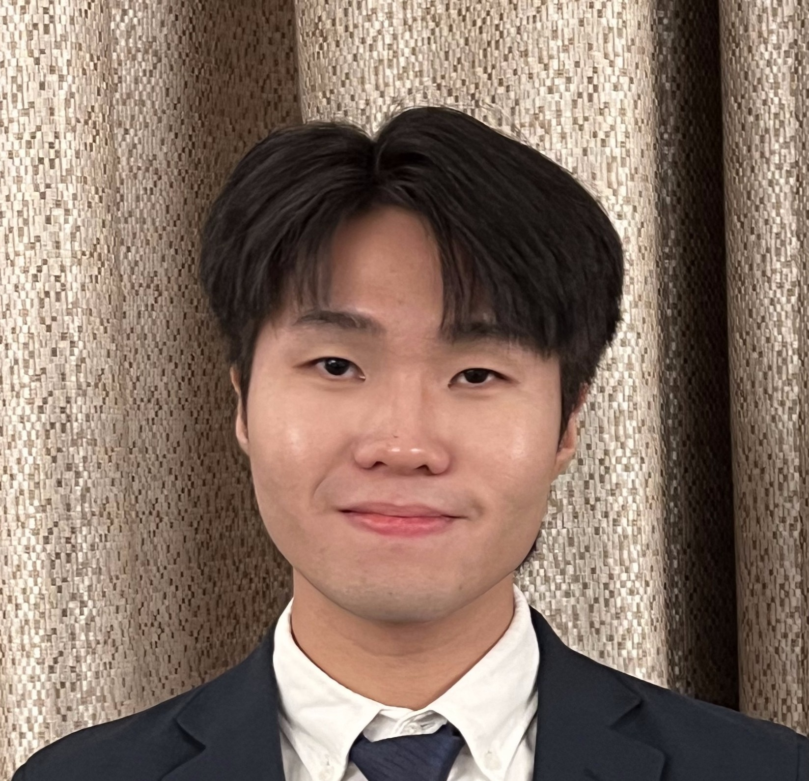
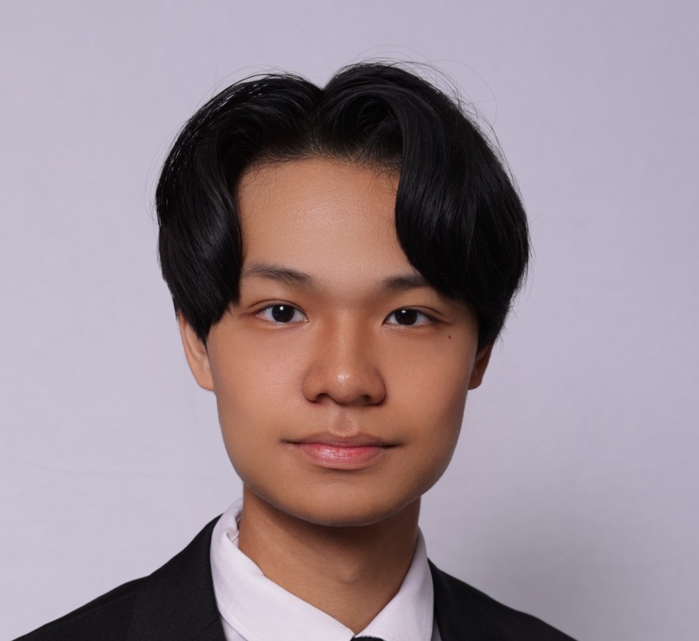

{:title "Our Team"
 :layout :page
 :page-index 1
 :navbar? true
 :to-root "../.."}

## Founder

    

        
        <h3 class="team-member-name">Dr. Matthias BUEHLMAIER</h3>
        <h2 class="team-member-position">Founder</h2>
        

            
View Description

            
Matthias Buehlmaier is a Principal Lecturer in Finance and the BBA(IBGM) Program Director at the HKU Business School (HKUBS), University of Hong Kong. He is also the Founding Director of the Centre for Investment Management at HKUBS. Buehlmaier has been a Visiting Fellow at the University of Cambridge and a Visiting Scholar at Regensburg University. His research has been published in notable journals and he has won several teaching and research awards. His interests include investment management, investment banking, mergers & acquisitions (M&A), machine learning, AI, and fintech. Buehlmaier developed and taught the world's first university course on text analytics and natural language processing in finance and fintech.

        

        

    

## Data Analysis Team

    

        
        <h3 class="team-member-name">Larina QU Hongru</h3>
        <h2 class="team-member-position">Senior Portfolio Manager, Head of Data Analysis 2025-26</h2>
        
Qu Hongru is currently a BEcon & Fin student and a part of the Data Analysis Team at CIM. Specializing in US healthcare industry investment, she has been building her skills in industry research and stock pitching. With a keen interest in portfolio management, Qu Hongru is passionate about applying her analytical abilities to develop thoughtful investment strategies and contribute to the dynamic world of finance.

        

    

    

        
        <h3 class="team-member-name">Allen JIANG Luning</h3>
        <h2 class="team-member-position">Senior Portfolio Manager, Deputy Head of Data Analysis 2025-26</h2>
        
Allen is a Accounting Data Analytics student at the University of Hong Kong, with a keen interest in financial analysis. In her role as a junior portfolio manager and member of the data analytics team, she expects to develop her investment strategy with the support of data and analytical tools. Through this long-term program, she hopes to develop a better market sense and make more informed trading decisions in the future.

        

    

    

        
        <h3 class="team-member-name">Carlos OR King Nang</h3>
        <h2 class="team-member-position">Junior Portfolio Manager</h2>
        
King Nang is a student studying International Business and Global Management at the University of Hong Kong. As an amateur investor majoring in finance, he possesses a deep understanding of the intricacies of financial markets. King Nang's passion for stock trading is matched only by his fascination with business analytics. His analytical mindset and dedication to staying informed about market trends make him a promising individual in the world of finance.

        

    

    

        
        <h3 class="team-member-name">Jonward XU Wenxuan</h3>
        <h2 class="team-member-position">Senior Portfolio Manager</h2>
        
Jonward XU Wenxuan is a student taking the double degree programme in Business Administration and Law. Jonward is now a senior portfolio manager in CIM. Jonward joined CIM because of interest in investment and asset management, and is now responsible for managing portfolios (mostly of energy industry), designing macro investment strategies and using programming to predict the stock price.

        

    

    

        
        <h3 class="team-member-name">Kelvin YUE Hohin</h3>
        <h2 class="team-member-position">Senior Portfolio Manager</h2>
        
Kelvin Yue is a student pursuing Economics & Finance at HKU. By joining CIM, he aims to develop a comprehensive understanding of various industries and make well-informed investment decisions through collaboration. His investment approach is grounded in meticulous research, analyzing companies' operations, macro-environment, fundamentals, and technicals. Committed to continuous learning, Kelvin strives to stay ahead in the ever-evolving world of finance.

        

    

    

        
        <h3 class="team-member-name">Sophia CHENG Ka Ki</h3>
        <h2 class="team-member-position">Senior Portfolio Manager</h2>
        
Sophia is a Data Science student pursuing a double major in Finance. Currently serving as a Junior Portfolio Manager within the Data Analysis team, she possesses a keen interest to deepen her knowledge of stock markets and investment management. With a focus on developing her quantitative and technical analysis skills, Sophia aspires to leverage machine learning techniques to enhance portfolio performance.

        

    

    

        
        <h3 class="team-member-name">Toby HUANG Hongbin</h3>
        <h2 class="team-member-position">Junior Portfolio Manager</h2>
        
Toby is a student from BSc(QFin), also with a double major in statistics. Toby currently serves as a junior portfolio manager at CIM and is also a part of the Data Analysis Team. Toby focuses on equity research and investment in the US real estate Industry. Joining CIM, he is eager to learn how to decide on investment strategies based on data analysis through programming. Toby regards CIM as a meaningful platform for him to get more investment skills and market sense.

        

    

## Web Development Team

    

        
        <h3 class="team-member-name">Ashley LEE Juyeon</h3>
        <h2 class="team-member-position">Senior Portfolio Manager, Head of Web Development 2025-26</h2>
        
Ashley Lee is a Computer Science student with a 2nd major in Finance. Her keen interests in both fields motivated her to join CIM, an interdisciplinary approach to technology and finance. Also part of the Web Development team, she currently explores both the financial and technical aspects of CIM.

        

    

   

         
         <h3 class="team-member-name">Louise Danielle SUGIARTO</h3>
         <h2 class="team-member-position">Senior Portfolio Manager, Deputy Head of Web Development 2025-26</h2>
         
Louise is a student studying BEng(DS&E). She developed strong communication, analytical, and creative skills that she's eager to bring to the team. Her investment interest started in high school, and it gave her the courage to explore the field more deeply. She's always open to learning from every experience by utilizing any given opportunity.

         

     

    

        
        <h3 class="team-member-name">Jerry TING Kit Lam</h3>
        <h2 class="team-member-position">Junior Portfolio Manager</h2>
        
Jerry is a student majoring in Financial Technology, with a particular interest in wealth management and equity trading. His goal is to enhance his understanding of financial markets and develop analytical skills as a junior portfolio manager at CIM. He believes that her experience in CIM will improve his research skills and help him better formulate trade strategies using both fundamental and technical analysis.

        

    

    

        
        <h3 class="team-member-name">Joey LAI In I</h3>
        <h2 class="team-member-position">Senior Portfolio Manager</h2>
        
Joey Lai In I is a student pursuing a Bachelor of Engineering in Computer Science. She has a strong passion for problem-solving, especially in artificial intelligence and robotics. Additionally, Joey is intrigued by the stock and finance markets and is eager to delve into these areas through data analysis. At present, she is part of the web development team at CIM, where she enjoys coding and collaborating with her peers. Joey is enthusiastic about broadening her understanding of the finance industry and gaining hands-on experience in investment.

        

    

    

        
        <h3 class="team-member-name">Selina DENG Jiahui</h3>
        <h2 class="team-member-position">Senior Portfolio Manager</h2>
        
Selina DENG, a Marketing Analysis & Technology student, is passionate about stock markets and portfolio construction. Currently serving as a junior portfolio manager at CIM, she is also actively engaged in A-share investments, where she applies analytical frameworks and tries to uncover actionable insights into evolving trends. Seeking to deepen her understanding of financial markets, she eagerly joined the CIM and remains committed to bridging academic knowledge with practical expertise, fostering growth in analytical rigor and investment acumen.

        

    

## Research Team

   

          
          <h3 class="team-member-name">Charles SHI Qiyuan</h3>
          <h2 class="team-member-position">Senior Portfolio Manager, Head of Research 2025-26</h2>
          
Charles Shi, a student majoring in Economics and Finance, is driven by a passion for applying in-depth knowledge in investment analysis. As part of the Research Team, he maintains a high degree of sensitivity to the financials equities and to emerging markets, such as India. Constantly refined analysis skills enables him to efficiently extract key information from dynamic data, demonstrating the potential for capturing investment opportunities and making data-driven decisions.

          

    

    

        
        <h3 class="team-member-name">Rachel HU Xinyue</h3>
        <h2 class="team-member-position">Senior Portfolio Manager, Deputy Head of Research 2025-26</h2>
        
Rachel Hu is a Economics & Finance student with a strong interest in the stock market and investment strategies. As part of the research team at the Centre for Investment Management, she monitors market trends, tracks macroeconomic shifts, and analyzes investment opportunities. Though new to finance, she is eager to apply her skills and contribute meaningful insights. Committed to continuous learning, she aims to develop market intuition and make informed investment decisions in the future.

        

    

    

        
        <h3 class="team-member-name">Alexander Antoniou</h3>
        <h2 class="team-member-position">Senior Portfolio Manager</h2>
        
Alec Antoniou is a multinational, results-driven student, leveraging his engineering background to identify and capitalize on strategic investment opportunities. With experience in fintech and corporate banking, he currently applies a data-driven, analytical approach to investment strategy in the Utilities team at CIM. His focus lies in energy and infrastructure banking across EMEA and emerging markets.

        

    

    

        
        <h3 class="team-member-name">David LU Zhiyuan</h3>
        <h2 class="team-member-position">Senior Portfolio Manager</h2>
        
David Lu Zhiyuan is a Computer Engineering student with a minor in Finance. Zhiyuan currently serves as a junior portfolio manager at CIM and is also a part of the research group. With strong analytical and problem-solving skills from his engineering background, he is eager to apply quantitative approaches to investment research and financial modelling. Through CIM, he hopes to refine his market analysis skills, gain exposure to different asset classes, and build a solid foundation for a future career in finance.

        

    

    

        
        <h3 class="team-member-name">Justin CHUNG Lok Yin</h3>
        <h2 class="team-member-position">Senior Portfolio Manager</h2>
        
Justin CHUNG Lok Yin, BFin (AMPB), specializes in the Utilities sector and Indian market research for CIM. With internships in Raffles Family Office, Safari Asia Asset Management and Teneo Financial Advisory, Justin has honed his analytical mindset and investment expertise. A proponent of value investing, fundamental analysis and long-termism, Justin welcomes opportunities to exchange experiences with new connections in the financial industry.

        

    

 

